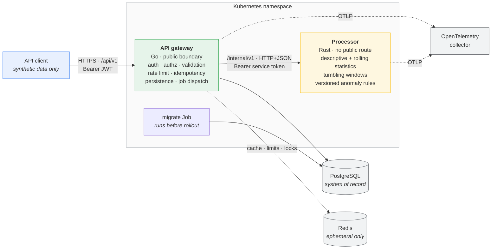
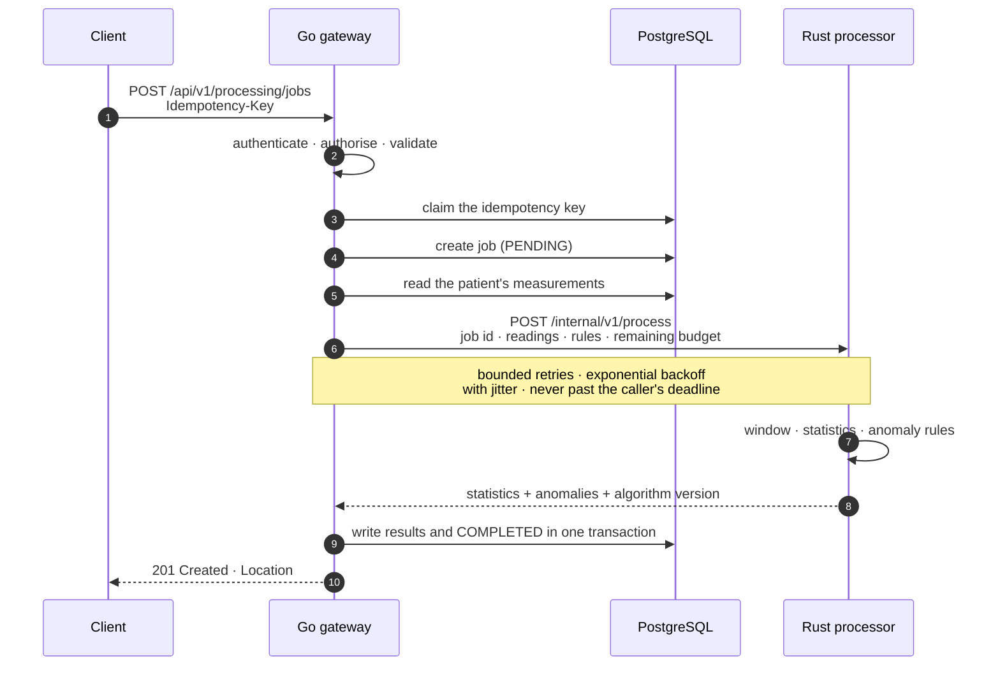
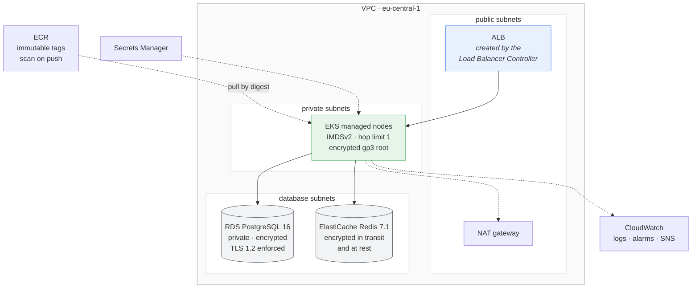
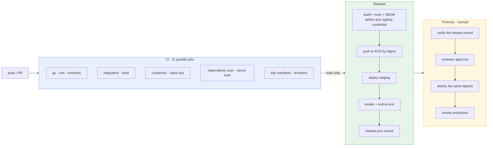

# VitalMesh

A cloud-native, production-oriented e-health data processing platform: a **Go**
API gateway and a **Rust** processing engine, with PostgreSQL, Redis,
Kubernetes, Terraform, OpenTelemetry and a GitHub Actions delivery pipeline.

> ### ⚠️ This is an educational and portfolio project, not a medical system
>
> VitalMesh is **not** a medical device, clinical decision-support system,
> diagnostic tool, treatment recommendation system, or healthcare product. It
> must not be used for any clinical purpose.
>
> Every "anomaly" it reports is a **technical data-processing result** — a
> value that departed from a configured statistical rule — and carries no
> medical meaning whatsoever.
>
> **All data is synthetic.** See [Synthetic data](#synthetic-data).

---

**Contents**

[Overview](#overview) · [Architecture at a glance](#architecture-at-a-glance) ·
[Key capabilities](#key-capabilities) · [Technology stack](#technology-stack) ·
[Architecture](#architecture) · [Local setup](#local-setup) · [Demo](#demo) ·
[API overview](#api-overview) · [Testing](#testing) ·
[Observability](#observability) · [Kubernetes](#kubernetes) · [AWS](#aws) ·
[CI/CD](#cicd) · [Security](#security) · [Performance](#performance) ·
[Limitations](#limitations-and-known-gaps) · [Synthetic data](#synthetic-data) ·
[Repository layout](#repository-layout)

---

## Overview

VitalMesh accepts synthetic health measurements over a REST API, validates and
stores them, and dispatches processing jobs to a separate Rust service that
performs deterministic statistical and anomaly analysis over time windows. The
results are written back and served through the same API.

It exists to demonstrate backend and systems engineering end to end: two
languages with a versioned contract between them, a real relational schema with
migrations, resilience under dependency failure, observability that is designed
in rather than bolted on, infrastructure as code, and a delivery pipeline whose
gates actually block.

The engineering emphasis is on the parts that are usually skipped in a demo:

- **Explicit contracts.** The gateway↔processor API is an OpenAPI document with
  a fingerprint lock, and both services are tested against it.
- **Verified behaviour rather than asserted behaviour.** The resilience,
  backup, rollback and release claims each have a script that reproduces them,
  and the documentation records what was measured, including what failed.
- **Honest limits.** [Limitations](#limitations-and-known-gaps) lists what is
  missing and what is assumed rather than tested. Nothing here is silenced to
  make a report look clean.

`SPECIFICATIONS.md` is the authoritative specification for the system, and
[docs/ARCHITECTURE.md](docs/ARCHITECTURE.md) explains how the parts fit
together and why.

### What it is not

- Not a medical or clinical system of any kind.
- Not deployed anywhere. There is no hosted instance; the AWS and Kubernetes
  material is infrastructure code that has been validated and, in the case of
  Kubernetes, exercised on local clusters.
- Not a library or framework meant to be depended on.

---

## Architecture at a glance



Solid lines are on the request path. Dotted lines degrade: losing Redis costs
caching, shared rate limiting and the idempotency lock but not correctness, and
losing the collector costs traces but not requests.

---

## Key capabilities

**API and data**

- Token authentication (HS256 JWT, 15-minute default lifetime) and role-based
  authorization across three roles.
- Patients and measurements with validation, cursor pagination and filtering.
- Idempotent writes: `Idempotency-Key` on every creating endpoint, with replay
  of the stored response and refusal of a reused key with a different body.
- Rate limiting with IETF-draft `RateLimit-*` headers, backed by Redis and
  falling back to a per-replica counter when Redis is unavailable.
- An audit trail in PostgreSQL that records the actor and the request, and
  never a credential or a reading value.

**Processing**

- Descriptive statistics, rolling statistics and tumbling time windows.
- Anomaly detection over three rule kinds — threshold, z-score and rolling —
  scoped per measurement type and window, and **versioned**, so identical
  input, rules and algorithm version produce identical output.
- Bounded by design: bounded memory, bounded concurrency, a per-job time limit,
  and admission control that refuses work rather than queueing it.

**Operations**

- Structured JSON logs, Prometheus metrics and W3C trace context propagated
  across both services.
- Every build identifies itself: commit, both toolchains, both lockfile
  digests, schema version, algorithm version and container image digest.
- A rehearsed rollback procedure that restores images, versions and
  configuration, and a rehearsed point-in-time database restore.

---

## Technology stack

| Layer | Choice | Version |
|---|---|---|
| API gateway | Go, standard-library `http.ServeMux` routing | `go 1.25.14` |
| Processing service | Rust, `axum` on `tokio` | toolchain `1.89.0`, edition 2024 |
| Database | PostgreSQL | 16 |
| Cache and counters | Redis | 7 locally, 7.1 on ElastiCache |
| Migrations | `golang-migrate/migrate` | v4.19.1 |
| PostgreSQL driver | `jackc/pgx` | v5.10.0 |
| Redis client | `redis/go-redis` | v9.22.0 |
| Password hashing | `golang.org/x/crypto` (Argon2id) | v0.55.0 |
| Metrics | `prometheus/client_golang` · `prometheus` crate | v1.24.1 · 0.14 |
| Tracing | OpenTelemetry Go SDK · `opentelemetry` crates | v1.46.0 · 0.32 |
| Containers | distroless, non-root, digest-pinned bases | `static-debian12` · `cc-debian12` |
| Orchestration | Kubernetes with Kustomize overlays | manifests target 1.30+ |
| Infrastructure | Terraform, AWS provider | `>= 1.11.0, < 2.0.0` · `~> 6.0` |
| CI/CD | GitHub Actions with OIDC | — |

Both images run as UID 65532 with a read-only root filesystem, no shell and no
package manager. Base images are pinned by digest, not by tag.

---

## Architecture

The Go gateway is the **only public boundary**. It authenticates, authorises,
validates, rate-limits, de-duplicates writes, persists to PostgreSQL — the
single system of record — creates processing jobs, and dispatches them to the
Rust service over a versioned internal HTTP/JSON API. The Rust service performs
deterministic, bounded-memory, bounded-concurrency processing and returns
versioned results. It has no public route and no database access.

### The gateway

Organised so that the domain does not know about transport or storage.
Handlers in `internal/httpapi` translate HTTP to and from services in
`internal/patient`, `internal/measurement`, `internal/processing` and
`internal/auth`; those services talk to interfaces implemented in
`internal/infra/{postgres,redisclient,processorclient}`. `internal/app` is the
only package that knows all of them, and wires them together.

The middleware chain, outermost first:

```text
RequestID → Trace → SecureHeaders → Logging → Metrics → Timeout → Recover → BodyLimit
```

then, per route: rate limit → authenticate → authorise → idempotency.
Authenticated routes are rate-limited *after* authentication, so a caller's
budget belongs to their account rather than to their address.

### The processor

A module per concern: `stats` (descriptive, rolling and windowed statistics),
`anomaly` (the versioned rule engine), `pipeline` (the end-to-end run),
`concurrency` (admission), `engine` (bounded, cancellable, time-limited
execution), `jobs` (a bounded registry), and `transport` (the HTTP surface).

### A processing request, end to end



The job id the gateway created travels with the request, so a duplicate still
running is refused by the processor with 409 rather than processed twice. A 5xx
leaves no idempotency record, so the client may safely repeat under the same
key.

### Data model

Eleven migrations build the schema: `users`, `patients`, `measurement_types`,
`measurements`, `processing_jobs`, `processing_results`, `audit_logs`,
`idempotency_keys`, plus supporting functions and triggers. Migrations are
**forward-only** in deployment and must keep the previous application version
working — a rule enforced migration by migration by an integration test. See
[docs/DATABASE.md](docs/DATABASE.md).

---

## Local setup

Docker with the Compose plugin is the only hard requirement; both services are
built as images and run in containers. Go and Rust toolchains are optional and
only needed to build or test outside containers.

```bash
git clone https://github.com/n0ah-n0wa/VitalMesh
cd VitalMesh

make up          # the whole environment: services, PostgreSQL, Redis, observability
make demo        # the twelve-step end-to-end demonstration
make down        # stop, keeping the database volume
```

Working on the code:

```bash
make setup       # check prerequisites, download dependencies
make build       # bin/api-gateway, bin/synth, and the Rust binary
make verify      # every code gate: format, lint, tests, coverage floors, build
make help        # every target, with a one-line description
```

`make verify` needs PostgreSQL and Redis (`make dev-db`, `make dev-redis`).
Prerequisites, Windows notes and the container-only workflow are in
[docs/DEVELOPMENT.md](docs/DEVELOPMENT.md).

---

## Demo

```bash
make demo
```

Twelve steps that exercise the whole system and print the request and the
response at each one, so the output is the explanation:

start the environment · create the demo account · authenticate · create a
synthetic patient · generate sixty heart-rate readings with one deliberate
spike · submit them as a batch · create a processing job · wait for it · read
the results · inspect the metrics · follow one trace id across both services ·
read the structured logs and the audit trail.

The first run builds the images, which takes a few minutes; later runs take
about half a minute. Everything it creates is synthetic: the account is on the
reserved `.invalid` domain, and the readings are a fixed series. Full walkthrough
in [docs/DEMO.md](docs/DEMO.md).

---

## API overview

All public endpoints live under `/api/v1`. `/health`, `/ready` and `/metrics`
are unversioned because they serve the platform rather than clients.

| Method | Path | Auth |
|---|---|---|
| `POST` | `/api/v1/auth/login` | no |
| `GET` | `/api/v1/auth/me` | yes |
| `POST` `GET` | `/api/v1/patients` | yes |
| `GET` `DELETE` | `/api/v1/patients/{patient_id}` | yes |
| `POST` | `/api/v1/measurements` | yes |
| `POST` | `/api/v1/measurements/batch` | yes |
| `GET` `DELETE` | `/api/v1/measurements/{measurement_id}` | yes |
| `GET` | `/api/v1/patients/{patient_id}/measurements` | yes |
| `POST` | `/api/v1/processing/jobs` | yes |
| `GET` | `/api/v1/processing/jobs/{job_id}` | yes |
| `GET` | `/api/v1/patients/{patient_id}/processing-results` | yes |

**Authentication.** `POST /api/v1/auth/login` returns an HS256 JWT carried as
`Authorization: Bearer <token>`. The default lifetime is 15 minutes, with a
24-hour ceiling. There is no self-registration; accounts are created with the
gateway's own `users create` command.

**Roles.** `ADMIN` (user management, plus everything below), `OPERATOR` (create
and delete patients and measurements, drive jobs), `USER` (read only). A denial
returns 403 and names neither the permission nor the role.

**Conventions.** Cursor pagination (`limit`, `cursor`; default 50, maximum 200)
returning `{items, next_cursor, has_more}`. `Idempotency-Key` on all four
creating endpoints. `X-Request-ID` and `X-Correlation-ID` echoed on every
response, and replaced rather than rejected when malformed. Unknown JSON fields
are rejected, so typos never pass silently.

**Errors.** One envelope, always:

```json
{
  "error": {
    "code": "VALIDATION_FAILED",
    "message": "The request is invalid.",
    "request_id": "DBYEUHL7YNZT4MHMR6CQZI55CT",
    "details": [{"field": "value", "message": "is required"}]
  }
}
```

`code` is stable and machine-readable; `message` never contains stack traces,
SQL or hostnames. The full reference, endpoint by endpoint, is
[docs/API.md](docs/API.md).

> **Note.** Both APIs have a machine-readable contract, each with a
> fingerprint lock that `make contracts-check` enforces. The public API is
> `contracts/openapi/vitalmesh-public-v1.json` (OpenAPI 3.0.3), checked
> against the routes the gateway actually mounts and against the error codes
> its source defines. The **internal** gateway↔processor contract is
> `contracts/internal-api/processor-v1.json`, confronted with both services'
> types.

---

## Testing

| Layer | What it covers | Command |
|---|---|---|
| Unit | Both services, Go with the race detector | `make test` |
| Contract | Both services' types against the internal contract document | `make contracts-check` |
| Integration | Real PostgreSQL and Redis: repositories, migrations, cache, rate limiting, idempotency | `make integration-test` |
| End-to-end | The real gateway against the real processor binary | `make e2e-test` |
| Stack | A clean containerized stack: 21 flows including failure injection | `make stack-test` |
| Load | k6, fixed mixed workload | `make load-test` |
| Kubernetes | Manifests on a real cluster; disruption; rollback rehearsal | `make k8s-local-test`, `k8s-resilience-test`, `rollback-test` |
| Restore | Point-in-time recovery against a real PostgreSQL | `make db-restore-test` |

**Coverage floors are enforced, not reported:** 70% for the Go unit suite and
85% for the merged unit + integration + end-to-end profile. The most recent
full run measured **71.8%** and **86.6%**.

The stack suite is the interesting one. Beyond the happy paths it injects
failures and asserts the system's response: the Rust service unavailable,
processing timeouts, the database down, Redis down, transient recovery, bounded
retries with no duplicate write, severed database connections, container
restarts, and the gateway killed mid-job.

---

## Observability

Three signals, designed in rather than added afterwards.

**Metrics.** Both services expose Prometheus at `/metrics`. Families include
HTTP requests, errors and latency by method and *matched route*; operation
counters and durations; database statement and Redis command latency; cache
hits; rate-limit decisions; the processor's job outcomes and saturation; plus
`build_info` and the applied database schema version.

**No metric label can carry a patient, user, request or trace id.** Routes are
the pattern axum or the mux matched, never the path, so a thousand patients are
one series. This is a design constraint, not a convention: there is nowhere in
the recording API to put such a value.

**Traces.** W3C trace context is propagated across both services and into the
logs, so one trace id follows a request from the gateway through the processor.
Span attributes carry route patterns rather than paths. Export is optional: an
unreachable collector degrades silently and never affects a request.

**Logs.** Structured JSON, one line per event, with `request_id` and `trace_id`
on each. Redaction is applied at the exit rather than at call sites, so it
cannot be forgotten, and the one format that bypassed it is refused in deployed
environments. Credentials, tokens, hashes and reading values are never logged.

Locally, `docker compose up` also starts Prometheus, Grafana (four dashboards)
and an OpenTelemetry collector. Nine alert rules ship in
`observability/prometheus/rules/`. See [observability/README.md](observability/README.md).

A deployed cluster runs the same rules from
[infrastructure/kubernetes/monitoring](infrastructure/kubernetes/monitoring):
Prometheus discovers both services through the Kubernetes API and scrapes
them, evaluates the recording and alerting rules, and posts to Alertmanager,
which publishes to the environment's alarm topic — the same SNS topic the
RDS and ElastiCache alarms use, so everything that can wake someone arrives
in one place. `make k8s-monitoring-test` proves the path on a kind cluster,
up to and including a real outage firing `ServiceDown` and arriving at
Alertmanager.

> SNS delivery itself is configured and has never been exercised against a
> real account, because there is none — see
> [Limitations](#limitations-and-known-gaps).

---

## Kubernetes

Kustomize, with a base and three overlays (`local`, `staging`, `production`).
The base is deliberately not applicable on its own: its image tags and its
Secrets are unusable placeholders, so an overlay must supply them.

**Workload shape.** Rolling updates with `maxUnavailable: 0` and `maxSurge: 1`,
so the old pods serve until the new ones are Ready. Startup, liveness and
readiness probes are separate. A `preStop` sleep covers endpoint withdrawal.
`revisionHistoryLimit: 5`. Deployments omit `replicas` entirely so the
HorizontalPodAutoscaler owns it.

**Autoscaling and disruption.** HPAs on CPU utilisation at 70% of request, with
per-environment floors and ceilings (production: gateway 2–20, processor 2–12).
PodDisruptionBudgets allow at most one unavailable pod per workload.

**Security.** Pod Security admission enforces `restricted` at the namespace.
Every container runs as non-root UID 65532 with a read-only root filesystem, no
privilege escalation and all capabilities dropped.
`automountServiceAccountToken: false` on both ServiceAccounts, on every pod
spec and on the namespace's `default` account. NetworkPolicies are
default-deny in both directions, with DNS the single blanket exception and
metrics scraping admitted only from a `monitoring` namespace.

**Migrations** run as a Job before the rollout, never on service start-up, so
several replicas starting at once cannot race through the schema.

Validated in CI by kubeconform, kube-linter, Trivy and Checkov across every
overlay (`make k8s-validate`), and exercised on local `kind` clusters for
deployment, disruption and rollback. Operational detail:
[docs/OPERATIONS.md](docs/OPERATIONS.md).

---

## AWS

Terraform under `infrastructure/terraform/`: a `bootstrap` root and `staging`
and `production` environment roots, over five modules (`network`, `eks`, `rds`,
`elasticache`, `platform`).



Provisioned: VPC across two or three availability zones with flow logs, EKS
with five managed add-ons, RDS PostgreSQL, ElastiCache Redis, ECR, three S3
buckets, Secrets Manager, five KMS keys, CloudWatch logs and alarms with SNS,
CloudTrail, ACM and Route 53, and IAM roles with a GitHub Actions OIDC provider.

Security settings worth naming: encryption at rest everywhere with customer
KMS keys and key rotation enabled; `rds.force_ssl` with a TLS 1.2 floor;
ElastiCache transit encryption required; RDS and ElastiCache private and
reachable only from the cluster security group; IMDSv2 required with hop limit
1; every S3 bucket fully public-access-blocked; ECR tags immutable with
scan-on-push; envelope encryption of Kubernetes Secrets in etcd.

Environments differ in size and durability rather than in shape: staging runs
single-AZ with 3-day backups and 14-day log retention; production runs multi-AZ
with 14-day backups, 365-day log retention, deletion protection and Performance
Insights.

> **Terraform is never applied by CI.** The only Terraform workflow runs
> `plan` under a read-only role that cannot write anything but the state lock.
> Applying is a human action, deliberately.

---

## CI/CD



**Nothing is rebuilt between staging and production.** A promotion deploys the
exact image digests staging ran, read out of a release record that exists only
if every staging stage passed. Production is promoted, never released to
directly, and the job waits on a reviewer who is not the person who dispatched
it.

**Immutable references throughout.** Images are named by `sha256:` digest, never
by tag; `latest` is never a deployment reference; ECR refuses to move a tag.
Every AWS credential is a short-lived OIDC token scoped to what that step does.
Image scanning runs *before* the registry login exists, so an image that fails
its scan is never pushed.

**Rollback** is a deployment of an earlier release rather than an undo: the
commit and both digests come from the release record, so the Kubernetes
manifests are restored along with the images. The procedure has been rehearsed
on a real cluster and each part of the result verified.
See [docs/ROLLBACK.md](docs/ROLLBACK.md) and [docs/DEPLOYMENT.md](docs/DEPLOYMENT.md).

---

## Security

| Area | Control |
|---|---|
| Passwords | Argon2id, 64 MiB memory, three passes, bounded concurrency |
| Tokens | HS256 JWT, 15-minute default with a 24-hour ceiling, `kid` for rotation |
| Authorization | Explicit route→permission table; a handler with no rule is a start-up error |
| Input | Exactly one JSON value, unknown fields rejected, 1 MiB body limit |
| SQL | Parameterised throughout; no string-built queries |
| Secrets | A `Secret` type in both services that refuses to render itself; no secret in Terraform state or variables |
| Containers | Non-root, read-only root filesystem, no shell, no package manager, digest-pinned bases |
| Supply chain | Both lockfiles verified; SBOM per image; third-party actions pinned to a commit |

Scanners run in CI and block: gosec, govulncheck, Trivy (images, Dockerfiles,
lockfiles, manifests, Terraform), Checkov, kube-linter, kubeconform, and
gitleaks over the full git history and the working tree. A **policy-drift gate**
fails if a severity threshold is lowered, a gate dropped, or a suppression left
unargued — verified by running it against a deliberately weakened configuration.

Every deliberate exception is documented with its reason beside the code and
collected in [docs/SECURITY.md](docs/SECURITY.md). Nothing is silenced to make
a gate green.

---

## Performance

**Read this first.** Every figure below is a measurement of *one run on one
machine* — a laptop under Docker Desktop with eight virtual CPUs and 3.8 GiB
for containers. They describe that machine as much as they describe the code.
**They are not capacity claims and not a promise about any deployment.**

Measured with the k6 standard profile, 120 seconds, client side, from an empty
database: about 7,860 requests at 60 req/s, roughly 77,000 readings at 580–610
readings/s, 241 jobs, zero errors.

| Operation | p50 (ms) | p95 (ms) |
|---|---|---|
| `POST /measurements` (one reading) | 6.1 | 10.9 |
| `POST /measurements/batch` (100 readings) | 23.1 | 50.2 |
| `POST /processing/jobs` (60 readings, end to end) | 17.7 | 30.5 |
| `GET /patients/{id}` | 1.6 | 2.7 |
| `GET /patients/{id}/measurements` | 2.2 | 3.9 |

Sign-in costs 0.19–0.33 s, which is Argon2id at 64 MiB doing its job rather
than a bottleneck to remove.

The methodology, the instruments, the identified bottlenecks and the changes
made — including the optimisations that were **rejected** for showing no
measurable benefit — are in [docs/PERFORMANCE.md](docs/PERFORMANCE.md).

---

## Limitations and known gaps

Stated plainly, because a portfolio that only lists strengths is not evidence
of engineering judgement.

**Nothing here has ever run in a cloud account.** That is the honest frame
for everything below: the Terraform validates and plans and has never been
applied, and no staging or production environment exists. Every AWS claim in
this repository is a claim about configuration.

**Alert delivery is configured and unproven.** The monitoring stack itself is
built and tested — Prometheus scrapes both services, the rules evaluate, and
an alert reaches Alertmanager, all verified on kind by
`make k8s-monitoring-test`. The last hop is not: `scripts/eks-platform-install.sh`
points Alertmanager at the environment's SNS topic through an IRSA role that
may publish to that one topic, and refuses to install without it, but nothing
has published to a real topic. Prometheus also keeps fifteen days of history
on an `emptyDir`, so it does not survive the pod, and the collector exports
spans to `debug` rather than to a trace store.

**Accepted, each with a compensating control** (argued in
[docs/PRODUCTION_READINESS.md](docs/PRODUCTION_READINESS.md)):

- No cross-region disaster recovery. The recovery target is stated as *none*
  rather than implied.
- The restore RTO is an estimate: the restore test ran against a local
  PostgreSQL, not RDS. The *procedure and its verification* are tested; only
  the duration and the RPO are assumptions, and both are labelled.
- Secrets reach the services as environment variables.
- No image signing or OCI provenance.
- No access-token revocation list; the 15-minute lifetime and a database
  re-read of account status stand in for one.
- The HPA scales on CPU only, which describes the gateway well and the
  processor poorly.
- Redis is not backed up; nothing in it is a system of record.

**Not yet written**

- User-management endpoints and job cancellation have authorization rules but
  no handlers, so they are not served.
- No `LICENSE` file is present yet.

---

## Synthetic data

**VitalMesh only ever holds synthetic data, and this is enforced by design
rather than by policy.**

- No names are generated at all.
- Email addresses live under the reserved `.invalid` top-level domain, which
  cannot resolve.
- Patient references are of the form `synth-<seed tag>-<number>`.
- Every value is drawn from a distribution named in the specification, from a
  seed, so a fixture is reproducible.

Nothing the generator produces describes a real person, and no real patient
data has ever been in this system. The generator and loader are documented in
[docs/SYNTHETIC_DATA.md](docs/SYNTHETIC_DATA.md):

```bash
make synth-generate SYNTH_ARGS="--seed 7 --patients 50 --days 30"
make synth-load
```

To restate the point at the top of this file: any anomaly VitalMesh reports is
a value that departed from a configured statistical rule. It is a technical
result about synthetic numbers, never a diagnosis, never a medical finding, and
never advice.

---

## Repository layout

```text
services/api-gateway/      Go API gateway: HTTP API, auth, persistence, job dispatch
services/processor/        Rust processing service: statistics, windows, anomaly rules
contracts/internal-api/    Gateway ↔ processor OpenAPI contract, with a fingerprint lock
contracts/openapi/         Public API contract (placeholder; see Limitations)
infrastructure/terraform/  AWS infrastructure as code (bootstrap + two environments)
infrastructure/kubernetes/ Kustomize base, three overlays, and kind cluster configs
observability/             Prometheus rules, Grafana dashboards, OpenTelemetry collector
scripts/                   The scripts behind the Makefile and CI
tests/load/                The k6 workload and its reports
docs/                      Architecture, operations and review documentation
.github/workflows/         CI, release, deploy, promote, terraform plan
.devcontainer/             Reproducible toolchain image
Makefile                   The developer interface (`make help`)
SPECIFICATIONS.md          The authoritative specification
```

### Documentation index

| Document | What it covers |
|---|---|
| [ARCHITECTURE.md](docs/ARCHITECTURE.md) | The system view: boundaries, data flow, state machine, decisions |
| [DEVELOPMENT.md](docs/DEVELOPMENT.md) | Prerequisites, every gate, reproducing CI locally |
| [DEMO.md](docs/DEMO.md) | The twelve-step demonstration |
| [API.md](docs/API.md) | The API reference: conventions, then every endpoint |
| [DATABASE.md](docs/DATABASE.md) | Schema, migrations, expand/contract practice |
| [RESILIENCE.md](docs/RESILIENCE.md) | Every retry, timeout and lease, classified |
| [FAILURE_MODES.md](docs/FAILURE_MODES.md) | What each dependency outage actually does |
| [OPERATIONS.md](docs/OPERATIONS.md) | Kubernetes behaviour under disruption, and runbooks |
| [PERFORMANCE.md](docs/PERFORMANCE.md) | How performance is measured and what was found |
| [SECURITY.md](docs/SECURITY.md) | Posture, scans, and every justified exception |
| [DEPLOYMENT.md](docs/DEPLOYMENT.md) | The pipeline, its gates and its artifacts |
| [RELEASE.md](docs/RELEASE.md) | What every build identifies about itself |
| [ROLLBACK.md](docs/ROLLBACK.md) | Going back a release, and what it cannot restore |
| [DISASTER_RECOVERY.md](docs/DISASTER_RECOVERY.md) | Backups, the tested restore, RPO and RTO |
| [PRODUCTION_READINESS.md](docs/PRODUCTION_READINESS.md) | The launch review and the ranked risks |
| [SYNTHETIC_DATA.md](docs/SYNTHETIC_DATA.md) | The generator, the loader, and what they never produce |
| [observability/](observability/README.md) | The local stack: scrapes, dashboards, rules and traces |
| [infrastructure/kubernetes/monitoring/](infrastructure/kubernetes/monitoring/README.md) | The deployed stack: what reads the metrics and delivers the alerts |
| [contracts/openapi/](contracts/openapi/README.md) | The public API contract, its gate and its versioning rules |
