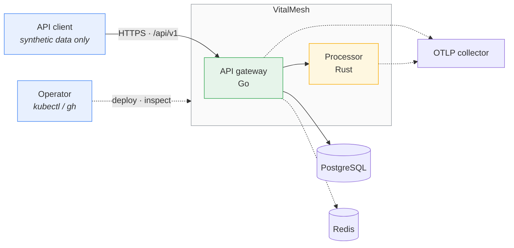
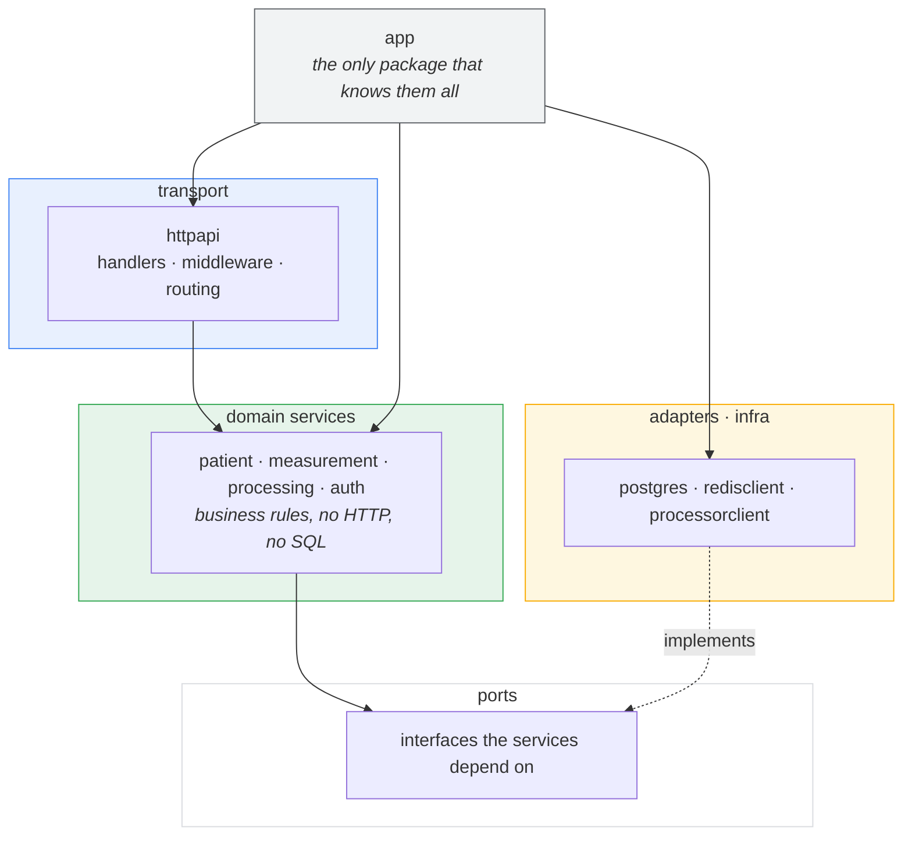
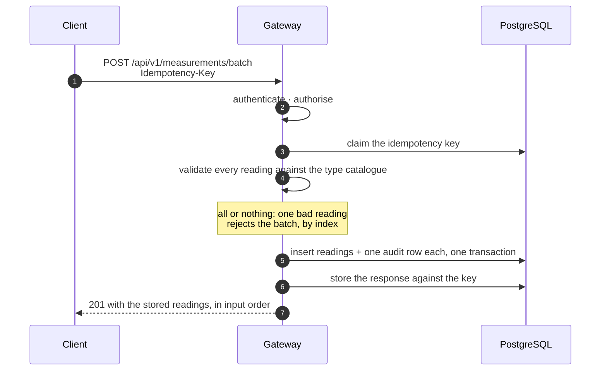
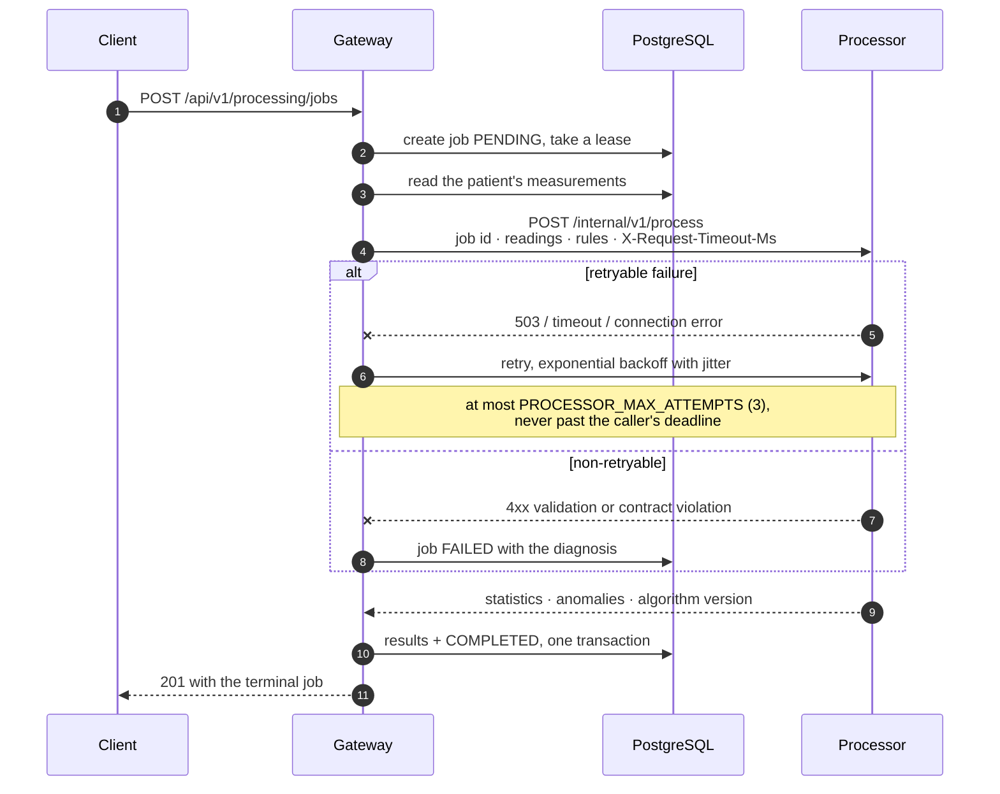
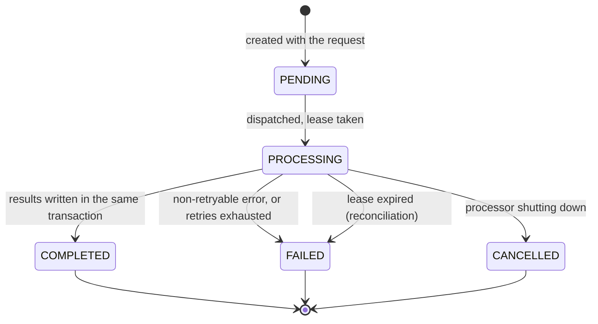

# Architecture

How VitalMesh is put together and why, at the level a new engineer needs
before changing anything. Per-service detail lives beside the code:
[services/api-gateway/README.md](../services/api-gateway/README.md) and
[services/processor/README.md](../services/processor/README.md). This
document is the system view and the decisions behind it.

Everything here describes what is implemented. Where something is
deliberately absent it says so.

- [System context](#system-context)
- [The two services](#the-two-services)
- [Boundary rules](#boundary-rules)
- [Inside the gateway](#inside-the-gateway)
- [Inside the processor](#inside-the-processor)
- [Ingesting a measurement](#ingesting-a-measurement)
- [Running a processing job](#running-a-processing-job)
- [The job state machine](#the-job-state-machine)
- [Reconciliation](#reconciliation-jobs-nobody-is-holding)
- [Data ownership](#data-ownership)
- [Decisions, and why](#decisions-and-why)

---

## System context



Solid edges are on the request path; dotted edges degrade without failing a
request. There is exactly one way in: the gateway's public API. No client,
operator or scheduled task reaches the processor or the database directly in
a deployed environment.

## The two services

| | API gateway | Processor |
|---|---|---|
| Language | Go | Rust |
| Public route | yes, `/api/v1` | **none** |
| Database access | yes, the only writer | **none** |
| Holds state across requests | no, beyond the database | a bounded in-memory job registry |
| Scales on | CPU (HPA) | CPU (HPA) plus its own admission limit |
| Listens on | 8080 | 8081 |

The split is not decorative. The gateway is I/O-bound work — authentication,
validation, SQL, HTTP — where Go's ergonomics and standard library fit. The
processor is CPU-bound numerical work over arrays, where Rust's control over
allocation and its lack of a garbage collector make the latency predictable
and the memory ceiling something you can reason about.

## Boundary rules

Four rules that the code enforces rather than merely documents:

1. **The gateway is the only public boundary.** The processor has no public
   route and no Ingress. In Kubernetes a default-deny NetworkPolicy makes
   this structural rather than conventional.
2. **The processor never touches the database.** It receives the readings it
   needs in the request body and returns results in the response. It cannot
   read or write anything else, because it has no credentials and no route.
3. **PostgreSQL is the single system of record.** Redis holds nothing that
   cannot be reconstructed: cache entries, rate-limit counters and
   idempotency locks. Losing Redis entirely costs performance and fleet-wide
   rate limiting, never correctness.
4. **The internal API is versioned separately from the public one.**
   `/internal/v1` moves on its own schedule under
   `contracts/internal-api/processor-v1.json`, whose fingerprint lock and
   tests on both sides make a silent drift a build failure.

## Inside the gateway

Ports and adapters, with the dependency arrow pointing inwards.



`internal/domain` holds the entities and the state machine and imports
nothing from the rest of the service. A feature service such as
`internal/patient` depends on an interface, not on `pgx`, which is what makes
the services testable without a database and what stops SQL details leaking
into business rules.

The middleware chain is fixed and ordered, outermost first:

```text
RequestID → Trace → SecureHeaders → Logging → Metrics → Timeout → Recover → BodyLimit
```

then per route: **rate limit → authenticate → authorise → idempotency**.

The order carries meaning. Authenticated routes are rate-limited *after*
authentication, so a caller's budget belongs to their account rather than to
their IP address. Authorisation runs after the limiter so that a refused
request costs no authorisation work. Idempotency runs last, inside the
authorised context, because a key is scoped to an account.

Routing is the standard library's `http.ServeMux` with Go 1.22 method and
pattern matching. There is no third-party router.

**Authorisation is table-driven and fail-closed.** `internal/authz/routes.go`
maps every operation to a permission, and `internal/httpapi/handler.go` binds
handlers. `Mount` registers only operations that appear in both, and a
handler with no rule is a **start-up error**, not a silent open route.

## Inside the processor

A module per concern, described in
[services/processor/README.md](../services/processor/README.md). What matters
at the system level is what bounds it:

| Bound | Mechanism |
|---|---|
| Concurrency | a semaphore that never waits; work beyond `MAX_CONCURRENT_JOBS` is **refused**, not queued |
| Time | every job runs under a deadline derived from the caller's remaining budget |
| Memory | a maximum readings per job, and a bounded job registry that evicts by age |
| Cancellation | a cancellation token threaded through the pipeline, checked between stages and windows |

Refusing rather than queueing is the important one. A queue would turn
overload into unbounded latency that the caller cannot see; a refusal is a
`503` with `Retry-After` that the caller can act on in milliseconds, and it
keeps the saturation visible in a metric rather than hidden in a buffer.

## Ingesting a measurement



Validation is against a **catalogue of measurement types** in the database,
not a hardcoded list, and a database trigger enforces the same rules the
application does, so a direct `INSERT` cannot bypass them.

## Running a processing job



Three properties worth knowing before changing this path:

- **The job is created before dispatch,** so a crash mid-flight leaves a row
  that [reconciliation](#reconciliation-jobs-nobody-is-holding) can find.
- **The job id travels with the request.** A duplicate dispatch of a job the
  processor is still running is refused with `409`, so a retry cannot process
  the same job twice.
- **Results and the state transition are one transaction.** A `COMPLETED`
  job always has its results; there is no window where it reports success
  with nothing to show.

Retry classification is specified in [RESILIENCE.md](RESILIENCE.md): transient
network and availability failures are retried, and validation, authentication,
authorisation and contract violations never are.

## The job state machine



`COMPLETED`, `FAILED` and `CANCELLED` are terminal. Transitions are
compare-and-set in SQL, so two writers racing on the same job cannot both
win, and the integration suite exercises exactly that race.

There is **no client-facing cancel endpoint**; `CANCELLED` is reachable only
because the processor's own graceful shutdown produces it.

## Reconciliation: jobs nobody is holding

A gateway that dies between "mark `PROCESSING`" and "write results" leaves a
job no one will ever finish. Dispatch therefore takes a **lease**
(`PROCESSING_JOB_LEASE`, 15 minutes), and a background sweeper in every
replica fails jobs whose lease has expired, in bounded batches
(`SweepBatch`, 100 rows per statement) so the sweep never blocks the write
path it shares a table with.

This is why the job row exists before the dispatch rather than after it. It
is the only piece of the system that repairs state rather than serving a
request, and `internal/processing/sweeper.go` is the whole of it.

## Data ownership

| Data | Owner | Lifetime |
|---|---|---|
| Users, patients, measurements, jobs, results, audit | PostgreSQL | durable; backed up, restore tested |
| Idempotency records | PostgreSQL (the claim) + Redis (an advisory lock) | `IDEMPOTENCY_TTL`, 24h default |
| Rate-limit counters | Redis, per window | seconds |
| Patient cache | Redis | `CACHE_PATIENT_TTL` |
| In-flight job registry | the processor's memory | bounded, evicted by age |
| Traces | exported, held nowhere | — |

Nothing in Redis is authoritative. The idempotency *claim* is a row in
PostgreSQL; Redis only holds a lock that makes the common case cheaper, and
its absence falls back to the database's own serialisation.

## Decisions, and why

**Two services rather than one.** The boundary buys a real internal contract,
independent scaling for CPU-bound work, and a place to demonstrate
cross-language integration. It costs a network hop on the job path, which is
why the gateway answers the create request only when processing has finished
rather than polling.

**Synchronous dispatch rather than a queue.** `POST /processing/jobs` returns
the terminal job. This keeps the demo legible and the failure modes few. The
cost is that a job is bounded by an HTTP request's lifetime, so the design
does not suit long-running work; a queue is the obvious next step and is not
pretended to exist.

**Migrations run as a Job before the rollout,** never on service start-up, so
several replicas starting at once cannot race through the schema. Migrations
are forward-only in deployment and must keep the previous version working,
which an integration test enforces migration by migration. See
[DATABASE.md](DATABASE.md).

**Redis is optional everywhere.** Every use degrades: cache miss, per-replica
rate limiting, lock skipped. The gateway starts and serves with Redis
unconfigured, and says so in a warning. This is why readiness depends on
PostgreSQL alone.

**Observability is a constraint, not a feature.** No metric label can take a
patient, user, request or trace id, because the recording API has nowhere to
put one. Redaction is applied where logs exit rather than at call sites, so
it cannot be forgotten.

**The processor is stateless with respect to the system.** It can be killed,
scaled or replaced at any moment; the only cost is the jobs in flight, which
the lease sweeper resolves.

### What is deliberately not here

- No message queue or background worker pool beyond the lease sweeper.
- No public OpenAPI document; [API.md](API.md) is the reference.
- No client-facing job cancellation.
- No multi-tenancy: a deployment serves one logical tenant.
- No read replicas or sharding; one PostgreSQL instance is the writer and
  the reader.

---

**Next:** [DEVELOPMENT.md](DEVELOPMENT.md) to run it, [API.md](API.md) for the
interface, [RESILIENCE.md](RESILIENCE.md) for every retry and timeout,
[OPERATIONS.md](OPERATIONS.md) for how it behaves in a cluster.
