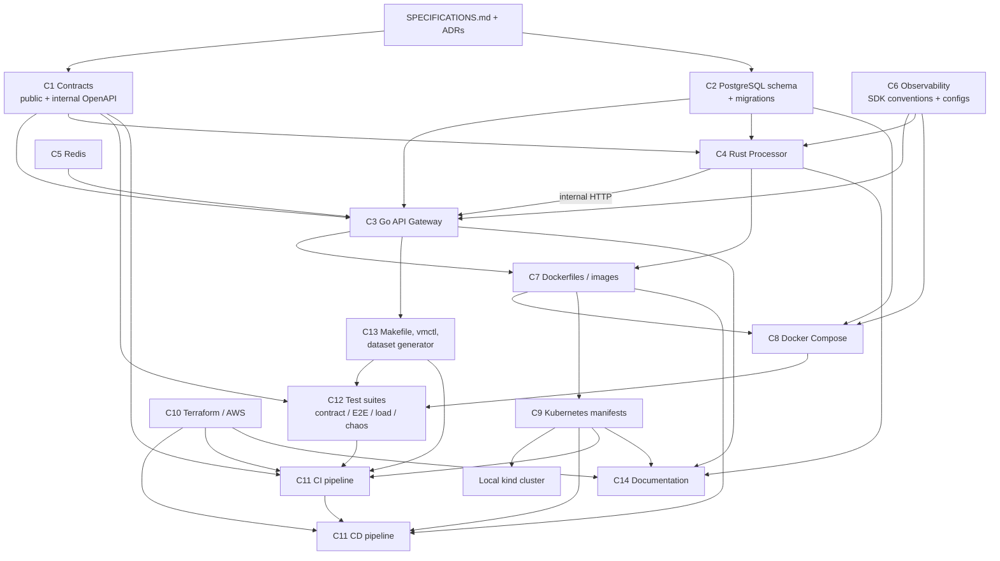

# VitalMesh — Implementation Plan

**Document:** `docs/IMPLEMENTATION_PLAN.md`
**Version:** 0.1 (reconnaissance and architecture planning pass)
**Status:** Proposed — awaiting resolution of the blocking items in [OPEN_QUESTIONS.md](OPEN_QUESTIONS.md)
**Authority:** `SPECIFICATIONS.md` v1.0 is authoritative (§114). This plan never overrides it; where the specification is silent or inconsistent the item is recorded in `OPEN_QUESTIONS.md` and resolved by an ADR before implementation.

Section references of the form `§nn` point to `SPECIFICATIONS.md`.

---

## 1. Scope of this document

This plan is the output of the repository reconnaissance required by §70 (inspect repository, inspect specification, identify constraints and affected components, propose the plan). It contains no application code. It defines:

1. the architectural understanding of the system and its components;
2. dependencies between components;
3. a phased, incremental implementation strategy with milestones;
4. testing, CI/CD and infrastructure strategies;
5. quality gates and the order in which they are introduced;
6. risks.

Repository state at the time of writing: `SPECIFICATIONS.md`, `.gitattributes`, one commit. No code, no tooling.

---

## 2. Architectural understanding

### 2.1 System in one paragraph

VitalMesh is a two-service, synthetic-data e-health processing platform. A **Go API Gateway** is the only public boundary: it authenticates (JWT), authorises (RBAC), validates, rate-limits (Redis), de-duplicates writes (idempotency keys), persists patients and measurements in **PostgreSQL** (the single system of record), creates processing jobs and dispatches them to a **Rust Processing Service** over a versioned internal HTTP/JSON API. The Rust service performs deterministic, bounded-memory, bounded-concurrency statistical and anomaly processing over time-windowed measurement streams and produces versioned results. Everything is observable by default (OpenTelemetry traces, Prometheus metrics, structured JSON logs, audit records), containerised, deployable to Kubernetes (locally on kind, in the cloud on EKS via Terraform), delivered by GitHub Actions with OIDC, and verified by a layered test suite that includes contract, end-to-end, load and failure-injection tests. It is explicitly a portfolio/reference system, not a medical product (§1, §3).

### 2.2 Components and responsibilities

| # | Component | Responsibilities (spec) | Key constraints | Primary spec sections |
|---|---|---|---|---|
| C1 | **Contracts** — public OpenAPI (`/api/v1`) and internal OpenAPI (`/internal/v1`) | Single source of truth for request/response schemas, errors, pagination, idempotency, auth docs | Generated or validated in CI; breaking internal changes fail CI without a version bump; public breaking changes require `/api/v2` | §8, §9, §10–13, §24–28, §49, §65 |
| C2 | **PostgreSQL schema + migrations** | Tables `users, patients, measurements, processing_jobs, processing_results, audit_logs, idempotency_keys`; constraints, indexes, UTC timestamps, UUIDs | Database enforces invariants independent of application validation; migrations versioned, locked, executed in deployment, rolling-upgrade compatible; SQLite never used | §19–22, §47, §64, §92 |
| C3 | **Go API Gateway** | REST API, auth, RBAC, validation, versioning, rate limiting, idempotency, DB access, job creation, Rust communication, error envelope, OpenAPI docs, health, metrics, tracing, logging, audit | Stateless, horizontally scalable; no numerical processing; timeouts, bounded retries, circuit breaking; graceful shutdown | §6.1, §9–13, §23–31, §35, §37–43, §45, §66, §83, §85–95 |
| C4 | **Rust Processing Service** | Receive jobs, validate, normalise, order, window-aggregate, statistics, anomaly rules, batch/concurrent processing, deterministic results, metrics/tracing/logging | Bounded memory, bounded concurrency (`MAX_CONCURRENT_JOBS`, `MAX_BATCH_SIZE`, `PROCESSING_TIMEOUT`), cancellation, timeouts, partial-failure reporting, algorithm versioning, horizontally scalable | §7, §8, §14–18, §36, §46, §91, §94–96 |
| C5 | **Redis** | Distributed rate limiting, short-lived cache, idempotency metadata, coordination | Never the system of record; application recoverable without it | §23, §29, §84, §90 |
| C6 | **Observability** | OTel traces across client → Go → Rust → DB/Redis, Prometheus metrics (bounded cardinality), JSON logs with request/trace IDs, audit logs, dashboards, documented alerts | Telemetry failure never affects availability; no sensitive data in logs/traces/metrics | §39–43, §82, §85, §109 |
| C7 | **Docker** | Multi-stage, minimal, non-root images tagged by git SHA; no secrets; deterministic builds | No `latest` in production; scanned in CI | §32, §98–99 |
| C8 | **Docker Compose (local)** | Full system locally with `docker compose up`, including observability where practical; no AWS credentials needed | Basis for E2E, load and chaos tests | §53, §108 |
| C9 | **Kubernetes** | Namespace, Deployment, Service, ConfigMap, Secret, HPA, PDB, NetworkPolicy, ServiceAccount, Role, RoleBinding; probes; security contexts; rolling updates with rollback; local kind cluster; overlays for staging/production | Deployable without source modification; least privilege | §33–36, §38, §62, §101–104 |
| C10 | **Terraform / AWS** | VPC, subnets, SGs, EKS, ECR, RDS PostgreSQL, ElastiCache Redis, IAM (OIDC, IRSA), CloudWatch, optional DNS/TLS; staging and production without duplication; isolated state | Least privilege, private data subnets, encryption, cost awareness, destroyable | §57–59, §79–80, §100, §103–105 |
| C11 | **GitHub Actions CI/CD** | PR pipeline (format → lint → static analysis → unit → integration → contract → build → container build → scans); CD (build → test → images → scan → ECR → staging → smoke → E2E → approval → production → verification) | OIDC, minimal permissions, pinned actions, required checks, environment approvals, no secrets in logs | §60–63, §75, §98–99 |
| C12 | **Testing** | Unit, integration, API, contract, E2E, database, security, load, benchmarks, failure injection | Real PostgreSQL; containerised E2E; reproducible load tests; documented failure behaviours | §44–52, §86, §96–97 |
| C13 | **Developer experience & tooling** | `Makefile` (`setup, dev, test, lint, format, build, integration-test, e2e, load-test, security-scan, verify`), developer CLI, synthetic dataset generator, demo scenario | One obvious health command; safe against local/staging; production destructive ops guarded | §54, §74, §106–108, §111 |
| C14 | **Documentation** | `README, ARCHITECTURE, DEVELOPMENT, OPERATIONS, SECURITY, API, PERFORMANCE`; ADRs; DR/backup; cost | Mermaid diagrams; no unsupported performance claims | §76–80, §97, §105 |

### 2.3 Working assumptions (pending ADRs)

The plan below is written against the *recommended defaults* in `OPEN_QUESTIONS.md`. The ones that shape the architecture most are repeated here so the reader does not need to cross-reference:

| Assumption | Source | Effect on the plan |
|---|---|---|
| Rust reads measurements from PostgreSQL in bounded keyset pages and writes results and terminal job status itself (job-reference model) | OQ-01, OQ-03 | Rust gets a `sqlx` dependency, a least-privilege DB role, a schema-compatibility test and RDS network access; internal request body is small |
| Jobs are pushed to Rust over `POST /internal/v1/process`; Rust applies a bounded admission gate; PostgreSQL is the durable job state; a Go reconciler re-dispatches `PENDING` and lease-expired jobs | OQ-02 | "Queue depth" = Rust wait queue + `PENDING` count; no broker; dispatcher hidden behind an interface |
| Login/logout/users endpoints are added to the public contract; HS256 JWT with `kid`, 15-minute lifetime, Argon2id passwords; admin bootstrapped by CLI | OQ-04, OQ-36 | Phase 2 scope grows to include user management |
| RBAC: ADMIN manages users; OPERATOR writes patients/measurements/jobs; USER reads | OQ-05 | Declarative route permission table + exhaustive tests |
| Job cancellation endpoint added; job parameters stored as JSONB; results are one row per (job, type, window, window_start) | OQ-06, OQ-07 | Contract and schema shapes in Phase 1 |
| Canonical unit per measurement type stored in a lookup table; batch ingestion is all-or-nothing | OQ-08, OQ-29, OQ-35 | Validation is DB-enforced; batch has a single transaction |
| `/metrics` served on a separate admin listener not exposed by Ingress | OQ-11 | Two ports per service in compose and Kubernetes |
| Kustomize for the app, Helm for third-party charts; rollback via `kubectl rollout undo` | OQ-17 | CD design in Phase 10 |
| `golang-migrate` SQL migrations run by a gateway subcommand as a pre-deploy Kubernetes Job | OQ-20 | Migration Job manifest; compose init service |
| Windows hosts are supported through documented prerequisites and a Dev Container; `.gitattributes` forces LF for scripts and manifests | OQ-21 | Phase 0 deliverables |

If any of these are decided differently, the affected phase's scope table is updated and the ADR is linked here.

### 2.4 Target repository layout

Refined from §68 (refinement is explicitly permitted as long as boundaries hold). Names in parentheses are new relative to §68 and each has a stated reason.

```text
vitalmesh/
├── services/
│   ├── api-gateway/                 Go module
│   │   ├── cmd/api-gateway/         serve | migrate | healthcheck | retention subcommands
│   │   ├── cmd/vmctl/               developer CLI (OQ-22)
│   │   ├── internal/                config, server, middleware, auth, users, patients, measurements,
│   │   │                            processing, audit, idempotency, ratelimit, storage/postgres,
│   │   │                            cache/redis, observability, synthetic (generator), gen/ (OpenAPI codegen)
│   │   ├── migrations/              SQL up/down files (single migration owner, OQ-03)
│   │   └── tests/                   Go integration tests needing PostgreSQL/Redis
│   └── processor/                   Rust workspace
│       ├── crates/processor-core/   (pure engine crate: no IO, deterministic, fuzzable)
│       ├── crates/processor-server/ (axum server, config, DB access, admission, telemetry)
│       ├── tests/                   integration tests + fixtures/
│       └── benches/                 criterion benches
├── contracts/
│   ├── openapi/                     vitalmesh-public-v1.yaml (+ examples)
│   └── internal-api/                processor-v1.yaml
├── infrastructure/
│   ├── terraform/{bootstrap,modules,environments/{staging,production}}
│   └── kubernetes/{base,overlays/{local,staging,production}}
├── deployments/
│   ├── docker/                      Dockerfiles, .dockerignore, hadolint config
│   └── compose/                     compose fragments, env templates, init scripts
├── tests/
│   ├── e2e/                         Go E2E suite against compose
│   ├── integration/                 cross-service integration (contract tests live here)
│   ├── load/                        k6 scenarios
│   └── chaos/                       (failure-injection scenarios and expected-behaviour docs, §52)
├── observability/{prometheus,grafana,otel}
├── scripts/
├── docs/                            ARCHITECTURE, DEVELOPMENT, OPERATIONS, SECURITY, API, PERFORMANCE,
│   └── adr/                         (Architecture Decision Records, §77 "major architectural decisions")
├── .github/workflows/
├── .devcontainer/                   (reproducible toolchain for Windows hosts, OQ-21)
├── Makefile
├── docker-compose.yml
├── README.md
└── SPECIFICATIONS.md
```

---

## 3. Dependencies between components

### 3.1 Dependency graph



### 3.2 Dependency table

| Dependent | Depends on | Kind | Why |
|---|---|---|---|
| Go gateway | Public contract | build-time | Handler types and request validation are generated/validated from the OpenAPI document |
| Go gateway | Internal contract | build-time | Rust client generated from the internal OpenAPI document |
| Go gateway | PostgreSQL schema | runtime + test-time | Repositories, migrations runner, DB integration tests |
| Go gateway | Redis | runtime (degradable) | Rate limiting, idempotency fast-path, token denylist, cache |
| Go gateway | Rust processor | runtime (degradable) | Job dispatch; unavailability leaves jobs `PENDING` |
| Rust processor | Internal contract | build-time | Server routes/types must match; CI diffs generated spec against the contract |
| Rust processor | PostgreSQL schema | runtime + test-time | Reads measurements, writes results and job status (OQ-01 B) |
| Both services | Observability conventions | build-time | Shared attribute names, log fields, metric names, header propagation rules |
| Docker images | Services | build-time | Multi-stage builds of each binary |
| Compose | Images, PostgreSQL, Redis, observability configs | runtime | Local system and test substrate |
| Contract tests | Contracts, both services (containers) | test-time | Go client vs Rust server validated against the internal contract |
| E2E / load / chaos tests | Compose, `vmctl`/generator | test-time | Need a running system and synthetic data |
| Kubernetes manifests | Images, service config surface (env vars), health endpoints, metric ports | deploy-time | Probes, ConfigMaps, NetworkPolicies mirror service behaviour |
| kind local cluster | Manifests, images | deploy-time | Validates manifests without AWS |
| Terraform | (none in repo) | deploy-time | Produces ECR, EKS, RDS, Redis, IAM OIDC role that CD consumes |
| CD pipeline | CI gates, images, Terraform outputs, manifests, smoke/E2E tests | deploy-time | Pushes to ECR via OIDC, applies overlays, verifies |
| CI pipeline | Makefile targets, test suites, contracts, scanners | always | Every gate is a Make target so local and CI behaviour are identical |
| Documentation | Everything | continuous | Each phase updates the relevant document (Definition of Done, §73) |

### 3.3 Critical path

`Contracts + schema (Phase 1)` → `Go gateway core (Phase 2)` → `Ingestion (Phase 3)` and `Rust engine (Phase 4)` in parallel → `Vertical slice with contract and E2E tests (Phase 5)` → `Observability (6)` and `Resilience (7)` → `Kubernetes (8)` → `Terraform (9)` → `CD (10)` → `Performance (11)` → `Operations, DR, audit (12)`.

Terraform (9) has no code dependency and can start any time after Phase 0, but its requirements (ports, secrets, IRSA needs, metrics ports) are only fully known after Phase 8, so it is sequenced after it to avoid rework.

---

## 4. Risks, ambiguities and contradictions

The full ambiguity register with options and recommended defaults is `OPEN_QUESTIONS.md`. This section lists the risks that most affect delivery and the mitigation the plan builds in.

### 4.1 Specification risks

| ID | Risk | Severity | Mitigation |
|---|---|---|---|
| R-S1 | **Processing data flow is undefined** (who reads measurements, who persists results). Choosing wrong forces a rewrite of the internal contract, the Rust IO layer and the NetworkPolicies. | High | OQ-01/02/03 are blocking for Phase 1; decision recorded as ADR before any contract is written |
| R-S2 | **Auth and user management endpoints are absent** although JWT, password hashing, LOGIN/LOGOUT audit and "create synthetic user" are required. | High | OQ-04/05/36; additive endpoints proposed; permission matrix tested exhaustively |
| R-S3 | **Cancellation is required in five places but has no endpoint.** | Medium | OQ-06; additive endpoint |
| R-S4 | **Job parameters and result shapes are unspecified** while determinism "under identical configuration" is mandatory. | High | OQ-07; parameters persisted with the job; results schema in Phase 1 |
| R-S5 | **Units and numeric bounds are unspecified.** Any chosen bound could be misread as medical guidance. | Medium | OQ-08; bounds documented as technical validation; disclaimer in API docs |
| R-S6 | **Idempotency named in both PostgreSQL and Redis**; **HTTP/gRPC vs HTTP/JSON**; **`/metrics` on the public surface**; **health path naming**. | Low | OQ-10/26/11/27; no spec change needed, resolved by interpretation and ADR |
| R-S7 | **No numeric quality targets** (coverage, latency). Gates could drift to whatever passes. | Medium | OQ-24; initial thresholds fixed in Phase 0, ratchet-only rule |
| R-S8 | **Batch ingestion semantics** (atomic vs per-item) change the public contract. | Medium | OQ-35 blocking for Phase 1 |

### 4.2 Technical risks

| ID | Risk | Severity | Mitigation |
|---|---|---|---|
| R-T1 | Two writers on one database (Go and Rust) can drift on schema and semantics. | Medium | Single migration owner; least-privilege DB role for Rust; schema-compatibility test in Rust CI; state transitions only via CAS updates |
| R-T2 | Exact percentiles over long windows vs bounded memory. | Medium | Per-job measurement ceiling with fail-fast; documented; sketches deferred until benchmarks justify |
| R-T3 | Determinism across Rust versions / CPU features (floating point, summation order). | Medium | Sequential fixed-order algorithms, golden fixtures, `algorithm_version` recorded per result, FP behaviour documented |
| R-T4 | Redis-dependent features must degrade, not fail: rate limiting, idempotency locks, token denylist. | Medium | Explicit degraded modes per feature (OQ-10/12/36), each with a failure-injection test |
| R-T5 | Retries creating duplicate writes (§37) in the Go→Rust dispatch path. | High | Dispatch is idempotent by `job_id`; Rust admission is CAS on job status; retries only on classified retryable errors (§93) |
| R-T6 | Graceful shutdown with in-flight jobs on Rust: lease/heartbeat needed so a killed pod's job is re-dispatched, not orphaned. | Medium | `lease_expires_at` + heartbeat in Rust; reconciler in Go; chaos test "pod restart during processing" |
| R-T7 | Contract drift between the internal OpenAPI file, the Go client and the Rust server. | High | Three gates: `oasdiff` breaking-change check, Rust generated-spec diff, live contract test with response validation |
| R-T8 | Cardinality explosion in metrics (patient IDs, request IDs as labels). | Medium | Metric naming review in Phase 6; lint rule/test that label sets are from a fixed allowlist |
| R-T9 | Distroless images cannot run `curl` for Docker `HEALTHCHECK`. | Low | `healthcheck` subcommand in each binary; Kubernetes probes use HTTP directly |

### 4.3 Delivery and environment risks

| ID | Risk | Severity | Mitigation |
|---|---|---|---|
| R-D1 | **Windows host, `core.autocrlf=true`**: shell scripts, Makefile, Dockerfiles checked out with CRLF break inside Linux containers and CI. | High | Phase 0: `.gitattributes` `eol=lf` rules for scripts/manifests, `.editorconfig`, CI check that no tracked text file contains CRLF |
| R-D2 | **Missing local toolchains** (Go, Rust, make, kind, Terraform, k6, Trivy, Gitleaks). | Medium | Phase 0: prerequisites doc, Dev Container, Make targets that fall back to Docker-run tools where practical |
| R-D3 | AWS cost: EKS control plane, NAT gateways, RDS, ElastiCache and ALB bill while idle. | High | Cost document (§105), `make infra-destroy`, staging with single-AZ/small instances, explicit teardown runbook, CD does not auto-apply Terraform |
| R-D4 | AWS access may not be available when Phases 9–12 are reached. | Medium | Terraform validated with `validate`/`tflint`/`checkov` and `plan` only; kind proves Kubernetes correctness independently; AWS-only tasks (restore test, staging E2E) clearly marked as requiring credentials |
| R-D5 | Scope is very large for incremental delivery; risk of half-finished cross-cutting concerns. | High | Each phase ends in a runnable, verifiable state with its own gates; vertical slice (Phase 5) early; observability and resilience get dedicated phases rather than being "sprinkled" |
| R-D6 | AI-agent discipline (§70–72): unrelated refactors, disabled lints, weakened tests. | Medium | Ratchet-only gate rule; PR template with §72 checklist; CODEOWNERS on CI, contracts, migrations, security-relevant paths |
| R-D7 | No registered domain → cannot issue a public ACM certificate. | Low | OQ-18: conditional Route 53 module; self-signed certificate imported to ACM as fallback |

### 4.4 Contradictions requiring a specification change

None identified that require editing `SPECIFICATIONS.md`. Every inconsistency found (OQ-10, OQ-11, OQ-26, OQ-27) resolves by interpretation without contradicting normative text. `SPECIFICATIONS.md` is therefore left untouched in this pass. If the decisions on OQ-01, OQ-04 or OQ-06 introduce endpoints or fields beyond the specification's lists, they are recorded as *additive* in ADRs and the API documentation; whether the specification itself should be amended is a deliberate follow-up decision (§114).

---

## 5. Phased implementation strategy

Principles applied to phasing:

- **Every phase ends green.** `make verify` and CI pass at the end of every phase, and the set of gates only grows.
- **Vertical slice early.** The full flow of §48 works end-to-end by Phase 5, before cloud infrastructure exists.
- **Contracts and schema first.** They are the coupling points; freezing them early lets Go and Rust proceed in parallel.
- **Nothing cloud-only until it has been proven locally** (compose, then kind, then EKS).
- **Cross-cutting concerns get their own phases** (observability, resilience) with explicit acceptance tests rather than being assumed.
- **One coherent change per commit** (§69), one phase per milestone.

Sizes are relative (S/M/L/XL) and refer to engineering effort for one engineer working with AI assistance. No calendar estimates are given.

### Phase 0 — Repository foundation and governance (size: S)

**Goal.** A repository skeleton where every later gate has a home, CI is green, and the blocking decisions are made.

**Entry criteria.** This plan reviewed.

**Deliverables.**
- Directory skeleton from §2.4 (empty directories carry a short `README.md` stating purpose, not `.gitkeep`).
- `.gitattributes` hardened for LF (`*.sh`, `Makefile`, `Dockerfile*`, `*.yml`, `*.yaml`, `*.tf`, `*.sql`, `*.toml`), `.editorconfig`, `.gitignore` (Go, Rust, Terraform, IDE, `.env*` except `.env.example`), `.dockerignore`.
- `Makefile` with every §54 target defined. Targets whose gate does not exist yet fail loudly with "not implemented in this phase" and are *not* included in `verify` until they are real (no silent green).
- `.github/workflows/ci.yml` skeleton: `permissions: {}` at top level, actions pinned by SHA, jobs: `secrets-scan` (Gitleaks), `line-endings` (CRLF check), `docs-lint` (markdownlint), `editorconfig-check`. Required checks configured on `main`.
- `.github/PULL_REQUEST_TEMPLATE.md` embedding the §72 verification loop; `CODEOWNERS` for `contracts/`, `migrations/`, `.github/`, `infrastructure/`.
- `docs/adr/` with template and ADR-0001 "Record architecture decisions"; ADRs for the *blocking* OQ items (OQ-01, 02, 03, 04, 05, 06, 07, 08, 35) drafted for review.
- `README.md` (purpose, non-medical disclaimer §1/§3, status), `docs/DEVELOPMENT.md` (prerequisites including Windows/WSL2/Dev Container notes), stubs for the other §76 documents with "not yet written" markers.
- `.devcontainer/devcontainer.json` pinning Go, Rust, make, Docker CLI, kind, kubectl, kustomize, Terraform, k6, Trivy, Gitleaks versions.
- `.env.example` with every configuration variable name from §66 and placeholder values only.

**Exit criteria / gates.** CI green on a PR; `make verify` runs the Phase 0 gates; all *blocking* OQ items `DECIDED`.

**Spec coverage.** §54, §68–72, §74 (skeleton), §76 (stubs), §31.

---

### Phase 1 — Contracts and data model (size: M)

**Goal.** Freeze v1 of both API contracts and the database schema so Go and Rust can be built in parallel against stable interfaces.

**Entry criteria.** Blocking ADRs merged.

**Deliverables.**
- `contracts/openapi/vitalmesh-public-v1.yaml` (OpenAPI 3.0.3 for broad tooling support): health, auth, users, patients, measurements (single, batch, list with filters, get, delete), processing jobs (create, get, list, cancel), results by patient; error envelope (§25); cursor pagination schema (§28); `Idempotency-Key` header; rate-limit headers; security scheme; request/response examples for every operation (§27).
- `contracts/internal-api/processor-v1.yaml`: `POST /internal/v1/process`, `GET /internal/v1/jobs/{job_id}`, `POST /internal/v1/jobs/{job_id}/cancel`, `GET /internal/v1/health`; headers `X-Request-ID`, `X-Correlation-ID`, `traceparent`, internal bearer token; structured error schema; explicit size limits documented.
- Contract tooling: `make contracts-lint` (Redocly CLI or Spectral), `make contracts-diff` (`oasdiff` against `main`, breaking changes fail for the internal contract, and for the public contract unless the path prefix changed), `make contracts-examples` (validate examples against schemas).
- `services/api-gateway/migrations/`: numbered SQL up/down files creating all §19 tables plus `measurement_types` lookup (OQ-29) and `schema_migrations`; §20 constraints (FKs, `CHECK` for statuses, `NOT NULL` timestamps, unique constraints from OQ-10/30); §21 indexes plus those from OQ-07; a seed migration for measurement types.
- `make db-migrate-test`: applies `up`, `down`, `up` against a PostgreSQL container and asserts required indexes exist via `pg_indexes` (§47 "verify indexes").
- `docs/ARCHITECTURE.md` v1: system context, container diagram, data flow decision, job state machine, ownership rules; `docs/API.md` pointing at the contract with conventions (versioning, pagination, idempotency, errors).
- ADRs for all *shaping* OQ items affecting Phases 1–3.

**Exit criteria / gates.** Contract lint and example validation green; `oasdiff` baseline established; migration up/down/up green in CI against PostgreSQL 16; ADR index updated.

**Spec coverage.** §8–13, §19–22, §24–28, §47 (migrations part), §64 (versioning), §65, §77 (first version), §92 (schema part), §95.

---

### Phase 2 — Go gateway foundation: server, auth, users, patients (size: L)

**Goal.** A production-shaped Go service with all cross-cutting middleware, real PostgreSQL persistence, authentication, RBAC, the patients API, a Dockerfile, and a compose environment.

**Entry criteria.** Phase 1 exit; OQ-04/05/09/11/14/24/28/36 decided.

**Deliverables.**
- Go module (`go.mod` with pinned `go` and `toolchain` directives), layout per §2.4, `golangci-lint` config, `govulncheck` target.
- Typed configuration (§66/§67): environment parsing, validation, safe defaults, fail-fast on invalid mandatory values; separate `local/test/staging/production` profiles by variables only.
- HTTP server: read/write/idle timeouts, max body size, secure headers, request/correlation ID middleware (OQ-28), panic recovery without stack leakage, error envelope (§25), conventional status codes (§26), JSON `slog` logging with §42 fields, Prometheus registry on the admin listener (OQ-11), OTel tracer provider with OTLP exporter that is a no-op when unconfigured (§90).
- Health and readiness (§35, OQ-14) and a `healthcheck` subcommand for container health checks (R-T9).
- PostgreSQL access via `pgx/v5` pool with latency metrics, transaction helper enforcing short transactions, repository layer, `migrate` subcommand wrapping `golang-migrate` (OQ-20).
- Users and auth: Argon2id hashing, login/logout/me, JWT issue/verify with `kid`, denylist via Redis with fail-open (OQ-36, Redis client introduced here minimally), RBAC middleware driven by a declarative route table (OQ-05), users CRUD and role change, audit records written in the same transaction as the state change (§22, §43), `vmctl users bootstrap-admin`.
- Patients API (§11) with cursor pagination (§28, keyset on `(created_at, id)`), soft delete (OQ-09), audit events.
- OpenAPI enforcement: `oapi-codegen` generated types and strict server interface; request validation middleware from the contract; a test asserting the router's route set equals the contract's operation set.
- Graceful shutdown (§38) for HTTP, DB pool, Redis, telemetry flush.
- `deployments/docker/api-gateway.Dockerfile`: multi-stage, `distroless/static:nonroot`, git SHA build args, Hadolint clean; image labels with commit and version.
- `docker-compose.yml` with `postgres`, `redis`, `migrate` (one-shot), `api-gateway`; `make dev`, `make setup`.
- Tests: unit (config, auth, pagination cursors, error mapping), handler tests with the generated client, middleware tests, auth/authz matrix tests, repository tests against real PostgreSQL (`tests/` with testcontainers-go or CI service containers), graceful shutdown test.
- CI additions: Go format/vet/lint/static analysis, unit tests, integration tests with PostgreSQL and Redis service containers, coverage gate (OQ-24), `govulncheck`, Hadolint, image build, Trivy image scan.

**Exit criteria / gates.** `docker compose up` → bootstrap admin → login → create/list/get/delete patient works; all Go gates in `make verify` and CI green; coverage at threshold.

**Spec coverage.** §6.1, §9–11, §25–26, §30 (application parts), §32, §35, §38, §39–43 (foundations), §45, §53 (partial), §55–56, §66–67, §85, §88 (HTTP/service/DB boundaries), §89.

---

### Phase 3 — Ingestion: measurements, idempotency, rate limiting, generator (size: L)

**Goal.** The write path is complete, safe under duplicates and abuse, and degrades correctly without Redis; synthetic data can be generated and submitted.

**Entry criteria.** Phase 2 exit; OQ-08/10/12/22/30/35 decided.

**Deliverables.**
- Measurements API (§12): single and batch create (all-or-nothing, OQ-35), list by patient with filters and cursor pagination (OQ-34), get, delete; validation at every boundary (§88): type/unit/bounds from the lookup table (OQ-08), timestamp rules (§86–87: RFC 3339 with offset normalised to UTC, reject impossible, future beyond `MAX_FUTURE_SKEW`, older than retention window), metadata size/depth/keys limits (§89), string length limits, duplicate detection (OQ-30).
- Idempotency (§24, OQ-10): PostgreSQL record of truth, Redis fast-path lock, fingerprint comparison, replay returns the original response, conflict semantics, expiry.
- Distributed rate limiting (§29, OQ-12): Redis Lua sliding window, per-role configurable limits, standard headers, `429` with `Retry-After`, in-memory fallback when Redis is unavailable, rate-limit event metrics.
- Redis client hardening: timeouts, latency metrics, health for readiness *reporting* (not gating), reconnect behaviour.
- Synthetic dataset generator package (§106) with seeded RNG for reproducibility: patients, per-type streams, noise, injected anomalies, configurable time range and volume; `vmctl generate`, `vmctl seed`, `vmctl measurements submit`.
- Tests: validation table tests, timestamp edge fixtures (DST offsets, leap day, boundaries), idempotency concurrency tests (parallel replays), rate-limit tests against real Redis and with Redis stopped, batch size and body size rejection tests, repository tests for indexes via `EXPLAIN` on the §21 access paths.
- k6 smoke script for ingestion (local only at this phase).

**Exit criteria / gates.** Demo steps 1–6 of §108 work locally; Redis stopped → API still serves with degraded rate limiting and idempotency; all gates green.

**Spec coverage.** §12, §23–24, §29, §84 (interface only, no cache yet), §86–89, §106–107 (partial).

---

### Phase 4 — Rust processing engine and service (size: XL)

**Goal.** A deterministic, benchmarked, bounded processing engine and an internal-API server that can run a job end-to-end against a seeded PostgreSQL.

**Entry criteria.** Phase 1 exit; OQ-01/02/03/07/15/16/27/31/38 decided. Can run in parallel with Phases 2–3 (needs only the contracts and the schema plus a seeded database; until Phase 3 exists, fixtures seed the database directly).

**Deliverables.**
- Cargo workspace with `rust-toolchain.toml`, `Cargo.lock` committed, `clippy -D warnings`, `rustfmt`, `cargo-deny` (licenses, advisories, bans), `cargo-audit`, `cargo llvm-cov` gate (OQ-24).
- `processor-core` (pure): input validation, normalisation (ordering, dedup, UTC), tumbling windows aligned per OQ-31 for the §15 default widths, statistics (count/min/max/mean/median/variance/stddev/configurable percentiles) with documented numerics (OQ-16), rolling average and moving standard deviation, anomaly rules (threshold, z-score, rolling deviation) with severity mapping and `algorithm_version` constant; result types matching OQ-07; streaming interfaces (iterator over pages) so memory is bounded by window state, not dataset size.
- Deterministic fixtures (§46, §96): golden input/output JSON pairs, a test that re-running yields byte-identical serialised results, property tests (`proptest`) for invariants (e.g. min ≤ median ≤ max, count equals input size, results independent of input page boundaries).
- `processor-server` (`axum`, `tokio`): typed config (§66) including `MAX_CONCURRENT_JOBS`, `MAX_BATCH_SIZE`, `MAX_JOB_MEASUREMENTS`, `PROCESSING_TIMEOUT`; routes per the internal contract; bounded admission (semaphore + bounded wait queue, `429`/`503` + `Retry-After` when full); job registry with cancellation tokens; heartbeat updating `lease_expires_at`; keyset-paged reads from PostgreSQL (`sqlx`, offline query metadata committed); CAS status transitions; results insert in one transaction per job; timeout handling; partial-failure warnings (OQ-15); failure metadata per §94; graceful shutdown (§38) that cancels in-flight jobs and releases leases; JSON `tracing` logs; Prometheus metrics (§41 processing set); OTel tracing with W3C propagation; internal bearer check (OQ-13); request size limits.
- Schema-compatibility integration test against the migrated database (OQ-03).
- Generated OpenAPI from server types (`utoipa`) diffed against `contracts/internal-api/processor-v1.yaml` in CI (R-T7).
- `benches/`: criterion benches for aggregation, anomaly scoring, serialisation, and a throughput harness with RSS/CPU capture (OQ-38); results *not* published yet.
- `deployments/docker/processor.Dockerfile`: multi-stage, static or `distroless/cc`, non-root, Hadolint clean, `healthcheck` subcommand.
- Tests: unit, integration (server + PostgreSQL), concurrency (N jobs bounded by `MAX_CONCURRENT_JOBS`), timeout, cancellation, serialization round-trips, admission rejection.

**Exit criteria / gates.** All cargo gates green in CI; golden fixtures pass; a job submitted with `curl` to the container against a seeded database produces results rows; determinism test green; benches compile and run in CI in "smoke" mode.

**Spec coverage.** §7, §8 (server side), §14–18, §46, §50 (benchmarks exist), §91–92 (Rust side), §94–96.

---

### Phase 5 — Vertical slice: jobs API, dispatch, contract tests, E2E, demo (size: L)

**Goal.** The §48 flow runs end-to-end in compose and in CI, with the internal contract enforced from three directions.

**Entry criteria.** Phases 3 and 4 exit; OQ-06/13/14 decided.

**Deliverables.**
- Go processing API (§13): create job (`202`, `PENDING`, parameters recorded, audit), get, list, cancel (OQ-06), results by patient; job state machine with CAS transitions (§92); `JobDispatcher` interface with an HTTP implementation generated from the internal contract; timeouts, bounded exponential-backoff retries on classified errors only (§93), circuit breaker around the processor (§37), idempotent dispatch by `job_id` (R-T5); reconciler for `PENDING` and lease-expired jobs using `SKIP LOCKED` so multiple gateway replicas cooperate; dead-letter metadata surfaced on `GET job` (§94).
- Contract tests (§49) in `tests/integration/contract`: Go generated client against the live Rust container with response validation against the internal OpenAPI document; `oasdiff` gate wired as a required check; Rust generated-spec diff from Phase 4 wired as required.
- E2E suite (§48) in `tests/e2e` (Go): starts compose (or targets a running stack via `E2E_BASE_URL`), authenticates, creates a patient, submits generated measurements, creates a job, waits for `COMPLETED`, retrieves and asserts results against the engine's golden expectations, exercises cancellation and idempotent replays. `make e2e`.
- `vmctl jobs submit|status`, `vmctl smoke` (used later by CD).
- Demo scenario document steps 1–9 (§108) and `make demo`.
- `docs/API.md` and `docs/ARCHITECTURE.md` updated with sequence diagrams for dispatch, retry and reconciliation.

**Exit criteria / gates.** E2E green in CI on every PR (compose in the runner); contract tests green; demo executed from a clean checkout by following `docs/DEVELOPMENT.md` only.

**Spec coverage.** §13, §37 (gateway resilience), §48–49, §92–94 (gateway side), §108 (1–9).

---

### Phase 6 — Observability completion (size: M)

**Goal.** Traces, metrics and logs are complete, correlated, dashboarded and verified by tests; the demo shows all three.

**Entry criteria.** Phase 5 exit; OQ-19 decided.

**Deliverables.**
- Tracing (§40): server spans, database spans (`pgx` tracer, `sqlx` instrumentation), Redis spans, outbound client spans with `traceparent` propagation, sampling configuration, attribute allowlist (no payloads, no identifiers beyond resource ids where safe), `trace_id` in every log line on both services.
- Metrics (§41): complete set per service; label allowlist test to prevent high-cardinality labels (R-T8); recording rules; `postgres_exporter` and `redis_exporter` in compose (optional profile).
- Logging (§42): field schema documented; redaction tests for passwords, tokens, measurement payloads.
- Compose `observability` profile: OpenTelemetry Collector, Prometheus, Grafana with provisioned dashboards (gateway, processor, dependencies), Jaeger; optional Loki.
- `observability/prometheus/alerts.yml` with documented alert intent (§109 "alerts are documented").
- E2E assertion of Go → Rust trace propagation by querying the trace backend for a single trace containing spans from both services (§109).
- Demo steps 10–12 (§108); `docs/OPERATIONS.md` monitoring and log inspection sections.

**Exit criteria / gates.** Trace-propagation E2E green; dashboards load with live data in compose; cardinality test green.

**Spec coverage.** §39–43 (complete), §85, §90 (telemetry failure tolerance test), §108 (10–12), §109 observability items.

---

### Phase 7 — Resilience, hardening, failure injection and load tests (size: L)

**Goal.** Every documented failure mode is tested; the system is safe under abuse and load locally.

**Entry criteria.** Phase 6 exit; OQ-23 decided.

**Deliverables.**
- Failure-injection suite (§52) in `tests/chaos` using Toxiproxy in a compose profile and container stop/start: PostgreSQL unavailable, Redis unavailable, processor unavailable, processor timeout, latency injection, processing failure, connection pool exhaustion, pod/container restart mid-job; each scenario has an expected-behaviour document and an automated assertion (§90 table, §37).
- Backpressure tests (§91): saturate the processor admission gate and assert jobs defer and are reconciled.
- Graceful shutdown validation (§38): SIGTERM during in-flight requests and jobs; assertions on lease release, requeue and telemetry flush.
- Security tests: authorization matrix (role × route), JWT tampering/expiry/`kid` rotation, secure headers, oversized bodies/batches/metadata, injection probes on filter parameters, rate-limit bypass attempts via header spoofing.
- Retention job (§81, OQ-23): bounded-batch deletion, idempotency expiry, audit and metrics; `make retention`.
- Load tests (§51): k6 scenarios for authentication, ingestion, batch ingestion, job creation, result retrieval, rate-limit behaviour; `make load-test` targets local; results template with hardware context (§97).
- `docs/SECURITY.md` v1 (threat model, controls, known trade-offs such as denylist fail-open) and `docs/PERFORMANCE.md` v1 (local numbers only, clearly labelled).

**Exit criteria / gates.** Chaos suite runs locally and in a nightly workflow; load test reproducible locally; security tests part of CI.

**Spec coverage.** §17 (cancellation/timeouts/backpressure verified), §30 (verification), §37–38 (verified), §51–52, §81, §90–91, §93–94 (verified).

---

### Phase 8 — Kubernetes manifests and local cluster (size: M)

**Goal.** The system deploys to a local kind cluster from manifests that are valid, secure and environment-parameterised.

**Entry criteria.** Phase 5 exit (images and health endpoints stable); OQ-17/25 decided. Can overlap with Phases 6–7.

**Deliverables.**
- `infrastructure/kubernetes/base`: Namespace, Deployments (both services, two container ports: app and admin/metrics), Services, ConfigMaps, Secret templates (values never committed), HPA (CPU/memory), PDB, NetworkPolicies (default deny; gateway → processor; both → PostgreSQL/Redis endpoints; Prometheus → admin ports), ServiceAccounts with `automountServiceAccountToken: false`, Roles/RoleBindings, migration `Job`, retention `CronJob`, probes per §35, security contexts per §34 (non-root, read-only root FS, drop all capabilities, seccomp `RuntimeDefault`), resource requests/limits, `terminationGracePeriodSeconds` aligned with §38.
- Overlays: `local` (kind, single replicas, in-cluster PostgreSQL/Redis for validation only), `staging`, `production` (replicas, limits, external endpoints).
- `kind` config, `make k8s-local` (create cluster, load images, apply, wait, run `vmctl smoke`), `make k8s-local-destroy`.
- Validation gates: `kubeconform` (with CRD schemas), `kube-linter` or Checkov Kubernetes checks, Trivy config scan, a policy test that every Deployment has probes, limits and a security context.
- Rollout and rollback rehearsal on kind (`rollout status`, `rollout undo`) scripted for reuse by CD.
- `docs/OPERATIONS.md` deployment/rollback/scaling sections.

**Exit criteria / gates.** `make k8s-local` green from a clean machine; manifest validation in CI; nightly kind deployment job green.

**Spec coverage.** §33–36, §38 (grace periods), §62 (mechanism), §101–102.

---

### Phase 9 — Terraform and AWS staging (size: L)

**Goal.** AWS infrastructure defined as code, validated and scanned in CI, applied to a staging environment following documented steps only.

**Entry criteria.** Phase 8 exit; OQ-18/33 decided; AWS account available (otherwise the phase stops at `plan`).

**Deliverables.**
- `bootstrap/`: S3 state bucket (versioned, encrypted), DynamoDB lock table, GitHub OIDC provider, CI roles (`plan` read-only, `deploy` scoped to ECR push + EKS access), applied manually once and documented.
- `modules/`: `network` (VPC, public/private subnets, NAT with single-NAT option for cost), `eks` (managed node group, IRSA, add-ons: VPC CNI, CoreDNS, kube-proxy, metrics-server, AWS Load Balancer Controller via Helm provider), `ecr` (two repositories, immutable tags, scan on push, lifecycle policy), `rds` (PostgreSQL, private subnets, encrypted, automated backups, PITR, parameter group, deletion protection configurable), `elasticache` (Redis, private, encryption at rest and in transit, auth token), `secrets` (Secrets Manager entries, generated passwords), `observability` (CloudWatch log groups, Fluent Bit values), `dns-tls` (conditional Route 53 + ACM, self-signed fallback).
- `environments/staging` and `environments/production`: thin roots with `tfvars`, isolated backends, size/replica differences only.
- CI (`infra.yml`): `terraform fmt -check`, `validate`, `tflint`, `checkov`, `terraform-docs` freshness; `plan` on PR when OIDC is configured (skipped with a clear notice otherwise); `apply` by `workflow_dispatch` gated by the `staging`/`production` GitHub environments.
- `docs/OPERATIONS.md` infrastructure sections; cost document (§105): drivers, idle charges, `make infra-destroy`, scale-to-zero notes.

**Exit criteria / gates.** All static Terraform gates green in CI; staging `apply` succeeds from the documented procedure; RDS and Redis reachable only from the cluster; ECR repositories exist.

**Spec coverage.** §57–59, §100, §103–105, §79–80 (infrastructure part).

---

### Phase 10 — CD: ECR publishing, staging deployment, production promotion, rollback (size: M)

**Goal.** `main` deploys itself to staging with verification; production requires approval; rollback is automatic on failed rollouts and rehearsed.

**Entry criteria.** Phases 8 and 9 exit; OQ-37 decided.

**Deliverables.**
- `.github/workflows/cd.yml` (§61): reuse CI gates → build images with git-SHA tags and digests → SBOM (`syft` or BuildKit attestations) → Trivy → push to ECR via OIDC → migration `Job` → `kustomize edit set image` with digests → `kubectl rollout status` → `vmctl smoke` → E2E subset against staging → `production` environment approval → same steps for production → post-deployment verification; `rollout undo` plus alert on any failed step (§62).
- Secret delivery per OQ-37 with masked output; no long-lived AWS keys anywhere (§63).
- Release identification (§98): a generated `release.json` artifact with commit, Go/Rust versions, lockfile hashes, image digests, Terraform module version, migration version.
- Rollback runbook executed once on staging and recorded (§109 "rollback is documented and tested").
- `docs/OPERATIONS.md` deployment, promotion, rollback, migrations sections finalised.

**Exit criteria / gates.** Two consecutive successful staging deployments from `main`; production deployment path exercised at least once (may target a minimal production environment that is destroyed afterwards for cost); rollback rehearsal recorded.

**Spec coverage.** §60–64, §98–99, §109 CI/CD items.

---

### Phase 11 — Performance validation and autoscaling (size: M)

**Goal.** Measured, reproducible performance numbers with workload context; autoscaling validated; optimisation only where evidence justifies it.

**Entry criteria.** Phase 10 exit (staging exists) or, without AWS, Phase 7 exit with local-only numbers.

**Deliverables.**
- Benchmark reports (§50, §97): criterion output and the throughput harness with CPU/RAM/OS/toolchain/dataset/concurrency/command recorded; committed under `docs/performance/` with dates.
- k6 runs against staging with Prometheus captures (p50/p95/p99, error rates, rate-limit events); HPA behaviour observed and documented (§36); custom-metric scaling only if CPU proves inadequate (OQ-25).
- Profiling (`pprof`, `perf`/flamegraphs) and any optimisation as separate evidence-backed PRs (§112).
- Caching (§84) introduced only for a candidate with a measured benefit, with explicit invalidation and a correctness test that stale data cannot change results.
- `docs/PERFORMANCE.md` complete; README contains no absolute claims without context.

**Exit criteria / gates.** Reports reproducible by `make benchmark` and `make load-test ENV=staging`; performance regressions guarded by a benchmark smoke job with generous thresholds (to catch order-of-magnitude regressions, not noise).

**Spec coverage.** §36, §50–51, §84, §97, §112 "optimize with evidence".

---

### Phase 12 — Operations, disaster recovery, documentation and final audit (size: M)

**Goal.** The repository meets §109 and §115; a competent team can run, deploy, monitor, diagnose, scale, secure, reproduce and evolve the system from the documentation alone.

**Entry criteria.** Phases 10–11 exit.

**Deliverables.**
- DR and backup documentation (§79–80): RPO/RTO numbers, backup retention, PITR, restore procedure executed once on staging and recorded (OQ-32), infrastructure recreation, secret recovery, failure scenarios.
- Data retention policy documented with configuration (§81).
- Supply chain (§99): SBOMs attached to releases, image signing with `cosign` keyless if practical, dependency update policy (§56).
- Complete `README`, `ARCHITECTURE` (all §77 items, Mermaid diagrams), `DEVELOPMENT`, `OPERATIONS` (all §78 items incl. troubleshooting), `SECURITY`, `API`, `PERFORMANCE`.
- Fresh-checkout validation of §111 by following the documents on a clean machine (or the Dev Container) and recording the outcome.
- Final audit per §110 as `docs/AUDIT.md` with each checklist item, evidence link and any remaining deviations; `OPEN_QUESTIONS.md` deleted once all items are closed.

**Exit criteria / gates.** Audit report shows every §109 criterion satisfied or explicitly deviated with reason; environments destroyed or scaled down with cost note.

**Spec coverage.** §76–82, §98–99, §105, §109–111, §115.

---

## 6. Milestones

| Milestone | Definition | Delivered by |
|---|---|---|
| **M0 — Green skeleton** | CI passes on an empty repository with governance in place; blocking ADRs accepted | Phase 0 |
| **M1 — Contracts and schema frozen** | Public and internal OpenAPI v1 plus migrations validated in CI | Phase 1 |
| **M2 — Gateway runs locally** | Login, RBAC, patients API in compose with full Go gates | Phase 2 |
| **M3 — Ingestion complete** | Measurements, idempotency, rate limiting, generator; Redis-degraded mode works | Phase 3 |
| **M4 — Engine proven** | Deterministic engine with golden fixtures, bounded server, benches | Phase 4 |
| **M5 — Vertical slice** | §48 flow passes E2E in CI; contract tests enforce the internal API | Phase 5 |
| **M6 — Observable** | Traces across services, dashboards, alerts documented, trace E2E | Phase 6 |
| **M7 — Resilient** | Chaos and load suites reproducible; security tests in CI; retention job | Phase 7 |
| **M8 — Kubernetes-ready** | kind deployment green; manifests validated and secured | Phase 8 |
| **M9 — Cloud staging** | Terraform-applied staging; automated deployment from `main` | Phases 9–10 |
| **M10 — Production-ready** | Approval-gated production path, rollback rehearsed, performance and DR documented, final audit | Phases 10–12 |

---

## 7. Testing strategy

### 7.1 Layers and where they live

| Category (§44) | Location | Tooling | Substrate | Runs on |
|---|---|---|---|---|
| Go unit / handler / middleware / auth / authz | `services/api-gateway/internal/**/*_test.go` | `go test`, table tests, generated client | none | every PR |
| Go repository and DB tests (§47) | `services/api-gateway/tests/` | `go test` with real PostgreSQL 16 (service container or testcontainers-go) | PostgreSQL, Redis | every PR |
| Migrations | `make db-migrate-test` | `golang-migrate`, `pg_indexes` assertions, `EXPLAIN` checks on §21 paths | PostgreSQL | every PR |
| Rust unit / algorithm / serialization | `services/processor/crates/*/src` | `cargo test`, `proptest`, golden fixtures | none | every PR |
| Rust integration / concurrency / timeout / cancellation | `services/processor/tests/` | `cargo test` with PostgreSQL | PostgreSQL | every PR |
| Rust benchmarks (§46, §50) | `services/processor/benches/` | `criterion`, throughput harness | none | smoke on PR, full nightly/manual |
| Contract tests (§49) | `tests/integration/contract/` | `oasdiff`, Rust generated-spec diff, Go client vs live Rust with response validation | containers | every PR |
| API tests | part of Go handler tests plus E2E | generated client, OpenAPI validation middleware | — | every PR |
| End-to-end (§48) | `tests/e2e/` | Go test harness over compose | compose | every PR (core flow), nightly (extended) |
| Security tests | Go tests + `tests/e2e/security` | authz matrix, header, size, JWT, injection probes | compose | every PR |
| Load tests (§51) | `tests/load/k6/` | k6 | compose or staging | manual/nightly; staging after deploy |
| Failure injection (§52) | `tests/chaos/` | Toxiproxy, compose stop/start, kind pod deletion | compose / kind | nightly, manual, before releases |
| Kubernetes validation | `infrastructure/kubernetes` | `kubeconform`, `kube-linter`/Checkov, kind deploy + smoke | kind | every PR (static), nightly (kind) |
| Infrastructure validation | `infrastructure/terraform` | `fmt`, `validate`, `tflint`, `checkov`, `plan` | AWS (plan only) | every PR (static), plan when credentials exist |
| Time-handling determinism (§86) | Go and Rust fixtures | DST-offset inputs, leap day, window boundaries, future/stale timestamps | none | every PR |
| Determinism / reproducibility (§96) | Rust golden tests | same input + config + version = byte-identical output | none | every PR |

### 7.2 Rules

- Tests protect contracts and invariants, not implementation (§112). Handler tests go through the generated client and the real router; repository tests go through real SQL.
- Real PostgreSQL everywhere; SQLite is forbidden (§47). Redis is real in integration tests; Redis-unavailable behaviour is tested by stopping it, not by mocking.
- Every failure mode listed in §90 and §52 has one automated scenario and one paragraph of expected behaviour.
- Fixtures for the engine are versioned with `algorithm_version`; changing an algorithm requires a new version and new fixtures, never editing old expected outputs.
- Coverage gates ratchet only upward (OQ-24). Tests are never deleted to pass CI (§71).
- Flaky tests are quarantined by label with an issue, never by deletion; the quarantine list is a CI-visible file.

---

## 8. CI/CD strategy

### 8.1 Workflows

| Workflow | Trigger | Jobs (each maps to a Make target) | Gates |
|---|---|---|---|
| `ci.yml` | pull request, push to `main` | `secrets-scan` (Gitleaks) · `line-endings` · `docs-lint` · `contracts` (lint, examples, `oasdiff`) · `go` (format, vet, `golangci-lint`, `govulncheck`, unit, integration with PostgreSQL/Redis services, coverage) · `rust` (fmt, clippy, `cargo-deny`, `cargo-audit`, test with PostgreSQL, coverage, bench smoke) · `db-migrations` · `contract-tests` · `e2e` (compose) · `build-images` (both, Hadolint, Trivy image scan, SBOM) · `k8s-validate` (kubeconform, kube-linter/Checkov) · `terraform-static` (fmt, validate, tflint, checkov) | all required for merge (§60); path filters are used only to *add* expensive jobs, never to skip core gates |
| `nightly.yml` | schedule, manual | `chaos` · `e2e-extended` · `kind-deploy` · `benchmarks-full` · `load-local` · dependency audit refresh | informational + issue creation on failure |
| `cd.yml` | push to `main` (after `ci.yml` success), manual | build → test → images (SHA tags, digests) → scan → push ECR (OIDC) → migrate staging → deploy staging → smoke → E2E-vs-staging → `production` approval → migrate production → deploy production → verification; `rollout undo` on failure | GitHub environments `staging` (auto) and `production` (required reviewers) (§61–63) |
| `infra.yml` | pull request touching `infrastructure/terraform`, manual | static checks; `plan` with read-only OIDC role when configured; `apply` only via `workflow_dispatch` with environment approval | OQ-33 |
| `security.yml` | schedule (weekly), manual | Trivy filesystem + image rescans, Gitleaks full-history, Checkov, dependency review | issue creation |

### 8.2 Rules

- Top-level `permissions: {}`; each job requests the minimum (`contents: read`, `id-token: write` only for AWS jobs) (§63).
- All third-party actions pinned to full commit SHAs with a comment naming the version; Dependabot/Renovate proposes updates but never merges them (§56).
- OIDC for AWS; no AWS access keys as secrets (§59, §63). Secrets are masked and never echoed; no `set -x` in deployment steps.
- Concurrency groups cancel superseded PR runs; `main` and CD runs are never cancelled mid-deploy.
- Caching for Go modules, Cargo registry/target, Docker layers (BuildKit cache to GHCR or GHA cache).
- Every job runs the same Make target a developer runs locally; CI must never contain logic that does not exist in the repository's task interface (§74).
- Images: tagged `<service>:<git-sha>`, deployed by digest; `latest` never used for deployment (§32).
- Branch protection on `main`: required checks = every `ci.yml` job, linear history, CODEOWNERS review for protected paths, no force pushes.
- Modifying CI to make it green is prohibited (§71); changes under `.github/` require CODEOWNERS review.

---

## 9. Infrastructure strategy

### 9.1 Environment matrix (§67)

| Environment | Substrate | Data stores | Purpose | Cost |
|---|---|---|---|---|
| `local` | Docker Compose (plus optional kind) | containers | development, demo, E2E, chaos, load | none |
| `test` | CI runners | service containers | automated gates | none |
| `staging` | EKS (Terraform) | RDS (small, single-AZ), ElastiCache (small) | deployment, migration, networking, observability, autoscaling, rollback validation (§103) | billed; destroyable |
| `production` | EKS (Terraform) | RDS (Multi-AZ optional), ElastiCache | production-shaped reference; approval-gated (§104) | billed; may be provisioned only for validation windows |

### 9.2 Local

- Compose profiles: `core` (PostgreSQL, Redis, migrate, gateway, processor), `observability` (collector, Prometheus, Grafana, Jaeger, exporters), `tools` (Toxiproxy, k6). `docker compose up` brings up `core` (§53); `make dev` brings up `core + observability`.
- kind for Kubernetes validation with in-cluster PostgreSQL/Redis (validation only, never a pattern for cloud).
- Dev Container for reproducible toolchains (OQ-21). No AWS credentials are ever required locally (§53, §105).

### 9.3 Terraform layering (§57, §100)

```text
bootstrap/        one-time: state bucket, lock table, OIDC provider, CI roles
modules/          network · eks · ecr · rds · elasticache · secrets · observability · dns-tls
environments/
  staging/        thin root, own backend key, tfvars (sizes, replica counts, single NAT)
  production/     thin root, own backend key, tfvars (Multi-AZ options, deletion protection)
```

- Environment roots differ in variables only; modules carry the logic, avoiding duplication.
- State isolated per environment; locking via DynamoDB.
- Least-privilege IAM: CI `plan` role read-only; CI `deploy` role limited to ECR push and EKS access entry; no long-lived credentials.
- Private data subnets, security groups allowing only cluster → RDS/Redis, encryption at rest and in transit, RDS automated backups and PITR (§59, §80).
- Cost controls: single NAT option, small instance classes, `deletion_protection` variable, documented `terraform destroy` order, idle-charge list (§105).

### 9.4 Kubernetes layering (§101)

- Kustomize `base` + `overlays/{local,staging,production}`; overlays change replicas, resources, HPA bounds, endpoints, Ingress annotations and image digests only.
- Third-party components (AWS Load Balancer Controller, metrics-server, kube-prometheus-stack, OpenTelemetry Collector, Fluent Bit) installed via Helm from Terraform or a `platform/` layer, separated from application manifests.
- Security baseline enforced by manifest tests (§34): non-root, read-only root FS, dropped capabilities, seccomp, no privilege escalation, resource limits, default-deny NetworkPolicies, minimal ServiceAccounts.
- Rolling updates with `maxUnavailable: 0`, readiness gates, PDBs, grace periods aligned with §38; rollback via `rollout undo` (OQ-17).

### 9.5 Observability platform (§39–43, OQ-19)

- Application side is stack-agnostic: OTLP export, Prometheus scrape endpoints, JSON logs to stdout.
- Local: Collector → Jaeger/Prometheus; Grafana provisioned from `observability/grafana/`.
- Cluster: kube-prometheus-stack, Collector, Tempo or Jaeger, Fluent Bit → CloudWatch Logs; dashboards and alert rules are the same files as local.

### 9.6 Disaster recovery (§79–80)

- RDS automated backups with documented retention and PITR; restore rehearsed once on staging (OQ-32).
- Infrastructure recreation = `bootstrap` + `terraform apply` + CD run; documented step by step with expected durations.
- Secret recovery via Secrets Manager versioning; JWT secret rotation via `kid` (OQ-04).
- RPO/RTO stated as numbers in `OPERATIONS.md` once measured.

---

## 10. Quality gates

Gates are introduced by phase and never removed. `make verify` is the union of all *local-runnable* gates present at any point; CI runs the same targets.

| Gate | Tool | Scope | Blocking on PR | Phase |
|---|---|---|---|---|
| Secret scanning | Gitleaks | whole repo, history on schedule | yes | 0 |
| Line endings / editorconfig | script, `editorconfig-checker` | tracked text files | yes | 0 |
| Markdown lint | markdownlint | `docs/**`, root docs | yes | 0 |
| ADR present for architectural change | PR template + CODEOWNERS | protected paths | review | 0 |
| OpenAPI lint + examples | Redocly/Spectral | `contracts/**` | yes | 1 |
| Breaking-change detection | `oasdiff` | internal contract (strict), public contract (strict within `/api/v1`) | yes | 1 |
| Migrations up/down/up + index presence | golang-migrate, SQL assertions | `migrations/**` | yes | 1 |
| Go format / vet / lint / static analysis | gofmt, go vet, golangci-lint (incl. staticcheck, gosec, errcheck) | Go module | yes | 2 |
| Go vulnerability check | govulncheck | Go module | yes | 2 |
| Go unit + integration tests | go test with PostgreSQL/Redis | Go module | yes | 2 |
| Go coverage threshold | go test -cover | `internal/**` excluding generated | yes (ratchet) | 2 |
| Route set equals contract operation set | Go test | gateway | yes | 2 |
| Dockerfile lint | Hadolint | `deployments/docker/**` | yes | 2 |
| Image build + vulnerability scan | Docker BuildKit, Trivy (HIGH/CRITICAL fail) | both images | yes | 2 / 4 |
| Redis-degraded behaviour tests | Go integration | rate limit, idempotency, denylist | yes | 3 |
| Rust format / clippy (`-D warnings`) | rustfmt, clippy | workspace | yes | 4 |
| Rust dependency policy and advisories | cargo-deny, cargo-audit | workspace | yes | 4 |
| Rust tests + coverage threshold | cargo test, cargo llvm-cov | workspace | yes (ratchet) | 4 |
| Determinism / golden fixtures | cargo test | engine | yes | 4 |
| Generated internal spec equals contract | utoipa diff | processor | yes | 4 |
| Schema-compatibility test | Rust integration | processor vs migrated DB | yes | 4 |
| Contract tests (client ↔ server) | Go test with containers | internal API | yes | 5 |
| E2E core flow | Go test over compose | whole system | yes | 5 |
| Metric label allowlist | test | both services | yes | 6 |
| Trace propagation E2E | Go test + trace backend query | whole system | yes | 6 |
| Log redaction tests | Go/Rust tests | both services | yes | 6 |
| Security tests | Go/E2E | authz, headers, sizes, JWT | yes | 7 |
| Chaos scenarios | compose/Toxiproxy | whole system | nightly | 7 |
| Load test reproducibility | k6 | whole system | nightly / manual | 7 |
| Kubernetes manifest validation | kubeconform, kube-linter/Checkov, Trivy config | manifests | yes | 8 |
| kind deployment + smoke | kind, vmctl | manifests + images | nightly | 8 |
| Terraform static checks | fmt, validate, tflint, checkov, terraform-docs | `infrastructure/terraform/**` | yes | 9 |
| Terraform plan | terraform (OIDC read-only) | environments | when credentials exist | 9 |
| SBOM + provenance | syft/BuildKit attestations | images | yes (generate), informational (verify) | 10 |
| Staging smoke + E2E after deploy | vmctl, E2E subset | staging | blocks promotion | 10 |
| Production approval | GitHub environment reviewers | production | manual | 10 |
| Post-deployment verification | vmctl smoke, health, metrics scrape | production | blocks completion | 10 |
| Benchmark regression smoke | criterion thresholds | engine | informational → yes after baseline | 11 |
| Final audit checklist | `docs/AUDIT.md` | repository | release | 12 |

`make verify` composition by phase end: Phase 0 (secrets, line endings, docs) → +Phase 1 (contracts, migrations) → +Phase 2 (Go gates, Dockerfile lint, image build) → +Phase 3 (Redis-degraded tests) → +Phase 4 (Rust gates) → +Phase 5 (contract tests, E2E) → +Phase 6 (observability tests) → +Phase 7 (security tests) → +Phase 8 (manifest validation) → +Phase 9 (Terraform static). Chaos, load, kind, benchmarks and cloud steps are separate targets (`make chaos`, `make load-test`, `make k8s-local`, `make benchmark`) because they are slow or need infrastructure.

---

## 11. Recommended implementation order and parallelism

1. **Phase 0** — foundation and blocking ADRs. Nothing else starts before OQ-01/02/03/04/05/06/07/08/35 are decided.
2. **Phase 1** — contracts and schema. Sequential; everything depends on it.
3. **Phase 2 → Phase 3** (Go track) **in parallel with Phase 4** (Rust track). The Rust track needs only the contracts, migrations and fixtures; the generator from Phase 3 replaces fixture seeding when it lands.
4. **Phase 5** — join point: jobs API, dispatch, contract tests, E2E, demo.
5. **Phase 6 and Phase 7** can interleave; Phase 6 first because resilience tests rely on metrics and traces for assertions.
6. **Phase 8** can start as soon as Phase 5 images are stable and overlap with 6–7.
7. **Phase 9 → Phase 10** — cloud. Terraform static work may be drafted earlier, but `apply` waits for Phase 8 so the manifests' requirements are known.
8. **Phase 11 → Phase 12** — evidence, operations, audit.

Documentation is updated in every phase (§73); it is never a trailing phase on its own, only finalised in Phase 12.

---

## 12. Proposed ADR list

| ADR | Title | Resolves |
|---|---|---|
| 0001 | Record architecture decisions | — |
| 0002 | Processing data flow: job-reference model with Rust database access | OQ-01, OQ-03 |
| 0003 | Job dispatch: push with bounded admission, PostgreSQL durable state, gateway reconciler | OQ-02, OQ-14 |
| 0004 | Authentication and user management endpoints; JWT and password hashing parameters | OQ-04, OQ-36 |
| 0005 | RBAC permission matrix | OQ-05 |
| 0006 | Job parameters, result schema and additive job fields | OQ-06, OQ-07, OQ-15, OQ-34 |
| 0007 | Measurement types, canonical units, technical bounds, duplicates, batch semantics | OQ-08, OQ-29, OQ-30, OQ-35 |
| 0008 | Patient lifecycle and delete semantics | OQ-09 |
| 0009 | Idempotency storage and semantics | OQ-10 |
| 0010 | Rate limiting design and Redis-degraded behaviour | OQ-12 |
| 0011 | Metrics listener separation and request correlation headers | OQ-11, OQ-28 |
| 0012 | Internal API authentication | OQ-13 |
| 0013 | Statistical numerics, windows, percentiles and memory ceilings | OQ-16, OQ-31, OQ-38 |
| 0014 | Migrations tooling and runner | OQ-20 |
| 0015 | Developer tooling: Makefile, Dev Container, CLI, generator | OQ-21, OQ-22 |
| 0016 | Retention job | OQ-23 |
| 0017 | Quality thresholds and ratchet policy | OQ-24 |
| 0018 | Kubernetes packaging and rollback mechanism | OQ-17, OQ-25 |
| 0019 | Ingress, TLS and DNS strategy | OQ-18 |
| 0020 | Observability platform | OQ-19 |
| 0021 | Terraform bootstrap, state and apply policy | OQ-33 |
| 0022 | Production secret delivery | OQ-37 |
| 0023 | Backup restore validation approach | OQ-32 |

---

## 13. Specification coverage map

| Spec sections | Phase(s) |
|---|---|
| §1–5 overview, goals, non-goals, architecture | 0 (README, ARCHITECTURE v1) |
| §6–8 responsibilities, inter-service communication | 1, 2, 4, 5 |
| §9–13 API surface | 1 (contract), 2, 3, 5 |
| §14–18 processing model, statistics, anomalies, batch, concurrency | 4 |
| §19–22 database | 1, 2 |
| §23–24 Redis, idempotency | 2 (minimal), 3 |
| §25–28 errors, status codes, OpenAPI, pagination | 1, 2 |
| §29 rate limiting | 3 |
| §30–31 security, secrets | 0, 2, 7, 9, 10 |
| §32 containers | 2, 4 |
| §33–36 Kubernetes | 8 |
| §37–38 resilience, graceful shutdown | 2, 4, 5, 7 |
| §39–43 observability, audit | 2 (foundation), 6 |
| §44–52 testing | 2–8 (per layer), 7 (load, chaos) |
| §53–56 local dev, DX, code quality, dependencies | 0, 2, 3, 4 |
| §57–59 IaC, AWS | 9 |
| §60–63 CI/CD | 0 (skeleton), every phase, 10 |
| §64–67 migrations, versioning, configuration, environments | 1, 2, 10 |
| §68–75 structure, git, AI rules, verification, security verification | 0, continuous |
| §76–80 documentation, DR, backups | every phase, 12 |
| §81–82 retention, privacy | 6, 7 |
| §83–84 performance architecture, caching | 2, 4, 11 |
| §85–89 correlation, time, validation, payload protection | 2, 3, 4 |
| §90–96 failure policy, backpressure, state machine, retries, failed jobs, versioning, reproducibility | 4, 5, 7 |
| §97–99 benchmarks, releases, supply chain | 10, 11, 12 |
| §100–105 environments, staging, production, cost | 8, 9, 10 |
| §106–108 demo data, CLI, demo | 3, 5, 6 |
| §109–115 acceptance, audit, final gate, principles, baseline, authority, completion | 12 |

---

## 14. What this pass did not do (by design)

- No application code, Dockerfiles, manifests, Terraform or workflows were created (task constraint).
- `SPECIFICATIONS.md` was not modified; no contradiction requiring a change was found (§4.4).
- No decision in `OPEN_QUESTIONS.md` has been applied; all recommended defaults await ADRs.
